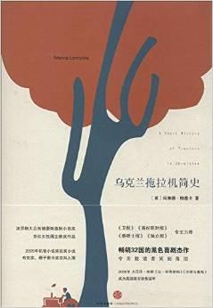
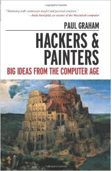
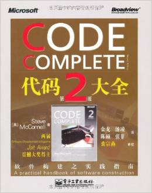
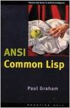

# Q4

## Literature 
1. **《乌克兰拖拉机简史》** ***(A Short History of Tractors in Ukrainian)***，2014, rating 4.5/5

  > 玛琳娜 * 柳薇卡

  

  《乌克兰拖拉机简史》作为畅销32国的黑色喜剧杰作，令无数读者笑到落泪。2006年力压
  丹·布朗《达芬奇的密码》《天使与魔鬼》成为英国图书销售冠军。

  “有权有势的人都一个样。他们有时称自己是共产党，有时是资本家，有时是虔诚的宗教
  信徒——不管怎样，他们需要的就是仅仅抓住权利不放。俄国的前共产党人就是现在的工厂
  大老板” - 《乌克兰拖拉机简史》

20. **《解忧杂货店》**，2014, rating 3.5/5.0

  > 东野圭吾  

  

  If I were 10 years younger, i would rate this book 5.0/5.0.
    I was attracted by its cover and name, it's really a warm design.

## Science & Technology, Philosopy
21. ***Hackers and Painters***, Rating 4.5/5.0

  > Paul Graham

  

## Technical
22. ***Code Complete*** 4.5/5.0

  > Steve McConnell

  

23. ***ANSI Common Lisp*** 4.5/5.0

  > Paul Graham

  

