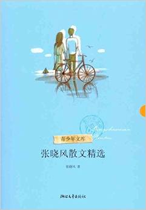
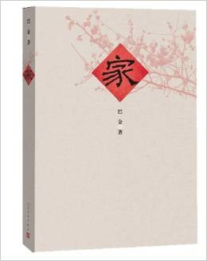
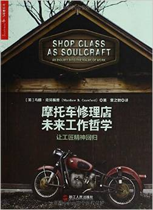
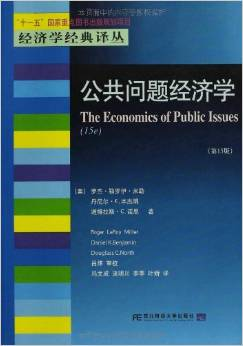
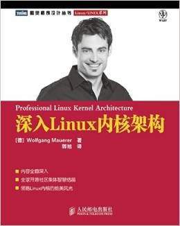
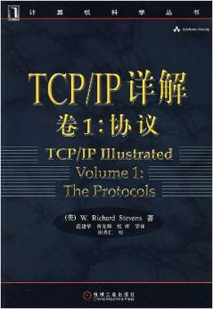
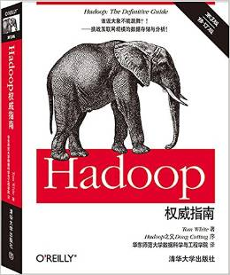
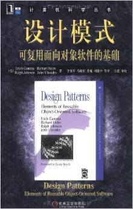
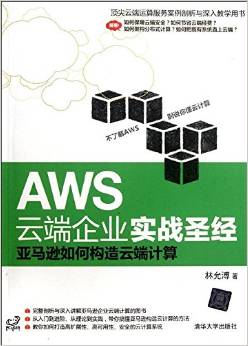
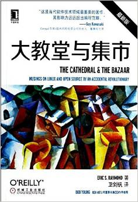

# Q2

# Literature & Social Science
1. **《张晓风散文精选》** 2011, 4.5/5.0

  > 张晓风

  

  十几年前就是张晓风的粉丝了, 读一本散文精选，再做一次青少年。

2. **《家》** 2013, 4.0/5.0

  > 巴金

  

  《家》是《激流三部曲》之一，是文学大师巴金的代表作，
  也是中国现代文学史上一部优秀的现实主义长篇巨制。
  《家》以**五四运动浪潮波及到的滞塞内地四川成都为背景**，
  真实地描写了高公馆这个“诗礼传家”、“四世同堂”的封建大家庭的没落分化过程，
  揭露了封建专制的腐朽本质，控诉了封建家族制度、封建礼教和封建迷信的罪恶，
  颂赞年轻一代的反抗斗争精神。

## Science & Technology, Philosopy
3. ***Shop Class as Soulcraft***, 4.0/5.0

  > Matthew B. Crawford

  

  《摩托车修理店的未来工作哲学》是一部**为工匠精神正名**的作品，
  一部探讨机械化生产时代如何重拾工匠精神的作品。它颠覆了鄙视体力劳动者的
  传统教育价值观，以一个新的视角重新探索和思考人类生活与工作的意义。

  本书**作者是拥有哲学博士学位的摩托车修理工**。他对现代的工作场所进行控诉，
  细数它让我们麻木不仁、死气沉沉的种种罪行，令人震撼。
  在书中，作者描述了教育体制如何摧残我们的天性，并向我们揭示了一种更丰富、更充实的生活方式。

4. ***The Economics of Public Issues***, 4.5/5.0

  > Roger LeRoy Miller, Daniel K.Benjamin

  

  三位经济学家以轻松且条理清晰的文风对我们司空见惯且习以为常的公共事务
  进行了颇具趣味性的分析，但是得出的结论却往往让我们大吃一惊。

  全书32章，作者给我们讲了32个学术故事，带我们经历了32次学术“历险”，
  使我们体会了32次恍然大悟！

  该书虽然冠以《公共问题经济学》，然则涵盖内容实在不止于“公共经济事务”，
  从经济分析的基础知识及基本的供需分析开始，还囊括了劳动力市场分析、
  市场结构分析、国际贸易分析等所谓的纯经济热点问题，
  更深人延伸到敏感的政治经济领域及财产权等法学领域，使经济学的研究范围大大扩展，也使我们更加大开眼界。

## Technical
5. ***Professional Linux Kernel Architecutre***, 5.0/5.0

  > Wolfgang Mauerer

  

  This book is for system programmers, administrators, developers of
  Linux-based solutions, and overall Linux enthusiasts.

  **A solid foundation of C programming is required**.

6. ***TCP/IP Illustated, Volume I: the Protocols***, 4.5/5.0

  > W. Richard Stevens

  

  Best book for TCP/IP. Volume 1 focus on the protocols, no code/implementation involved.

7. ***Hadoop: the Definitive Guide*** 4.0/5.0

  > Tom White

  

  Good book for hadoop beginners.

8. ***Design Pattern*** 4.5/5.0

  > Gang of Four

  

  **For really experienced software designers/architects.**

9. ***AWS云端企业实战圣经:亚马逊如何构造云端计算*** 4.0/5.0

  > 林允溥

  

  手把手教你AWS, 傻瓜式。作者是台湾人，在硅谷工作期间伴随了AWS的成长。

10. ***The Cathedral and the Bazaar*** 5.0/5.0

  > Eric Raymond

  

  **奇书**.

------------------------------------------------------
  [Previous: 2015 Q1](2015_Q1.md)          [Next: 2015 Q3](2015_Q3.md)
