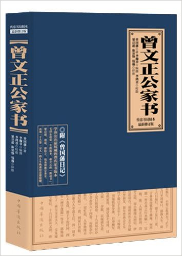
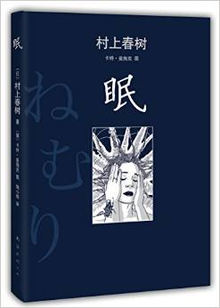
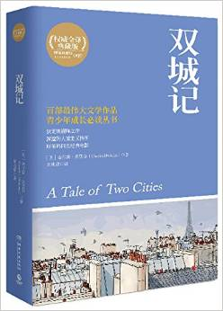
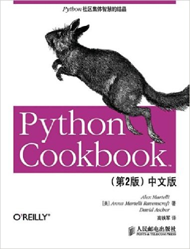
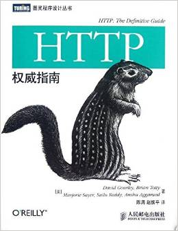
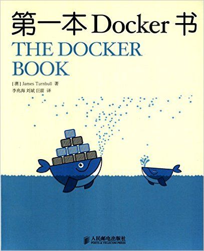
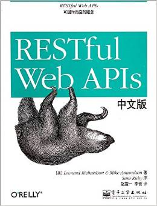
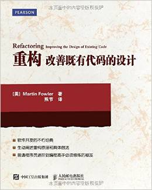
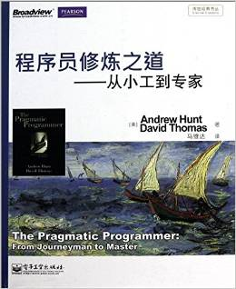
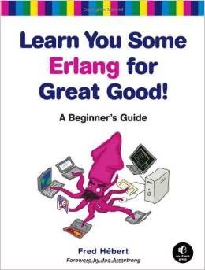

# Q3

## Literature
1. ***《曾文正公家书》*** 5.0/5.0

  > 曾国藩

  <p align="center"></p>

  **道德文章冠冕一代！**

  中学的历史教科书教给我的是，曾国藩是封建旧势力的代表人物，维护的是腐朽的
  清王朝的统治，镇压了正义的太平天国起义。所以虽然《曾国藩家书》评价甚高，
  却对起没有多大兴趣。许多年以后，慢慢看到了一些教科书之外的东西，
  才知道太平天国不过是一拨想夺取统治地位的流寇，其统治甚至比朝廷更加腐败。又过了许多年，
  想读点古典书籍，终于读到了《曾文正公家书》，才恍然大悟，原来曾国藩是如此一个奇男
  子！
  “道德文章冠冕一代”的评价实至名归。


2. **《眠》** 2013, rating 4.5/5.0

  > 村上春树

  <p align="center"></p>

  几个月前刚读过, 一直对其中一段印象深刻：主人公每天都会记日记，但是有一天突然发现，
  如果日记忘了写日期，就根本分不清哪天是哪天，因为每天做的事情都一样！猛然觉醒！

  在把这本书送给朋友之前，又读一遍。


3. **《双城记》** (***A Tale of Two Cities***), 1859, 5.0/5.0

  > Chales Dickens

  <p align="center"></p>

  `这是最好的时代，这是最坏的时代。但是归根到底，这是年轻人的时代。`，
  早就听到过这句经典，后来才知道，这是《双城记》的开篇。
  但是真正让我把此书列入reading list，是因为纸牌屋里一个情节。
  Francis的幕僚长Stamper，是个聪明，老练，几乎任何时候都不动感情的人，
  但是他有一个颇奇怪的习惯：非常喜欢双城记，
  尤其是喜欢听那个被他软禁起来的女人（忘了什么名字了）读给他听。
  每当听到诵读，他会闭上眼睛深深沉浸其中，想起小时候妈妈读给他听的景象，
  老练冷血的形象瞬间消失：

  ```
  It was the best of times,it was the worst of times,
  it was the age of wisdom, it was the age of foolishness,
  it was the epoch of belief,it was the epoch of incredulity,
  it was the season of Light,it was the season of Darkness,
  it was the spring of hope,it was the winter of despair,
  we had everything before us,we had nothing before us,
  we were all going direct to Heaven,we were all going direct the other way
  --in short,the period was so far like the present period,
  that some of its noisiest authorities insisted on its being received,
  for good or for evil,in the superlative degree of comparison only...
  ```

  《双城记》的故事让我想起文化\*\*命，都是类似的翻身解放的阶级由于某个导火索
  突然间亢奋，发疯（到泯灭人性），
  报复（小说里是革命的农民屠杀贵族和大量无辜平民）曾压迫他们的阶级的故事/历史，
  也进一步想起一句话：
  **历史不是正在上演，而是正在重复**。


## Science, Philosopy, Economics


## Technology
1. ***Python Cookbook***, 4.5/5.0

  > Alex Martelli, Anna Martelli Ravenscroft, David Ascher

  > 2005, 2nd edition

  <p align="center"></p>

  A wonderful book composed of independent small programs solved with python.

  The book is written with **Python2.x**, a little bit old today. But don't worry,
  the 3rd edition has been published, in Python3.x.

  Updated for Python 2.4, The Python Cookbook, 2nd Edition offers a wealth
  of useful code for all Python programmers, not just advanced practitioners.
  The book provides solutions to problems that Python programmers face everyday.
  It now includes over 200 recipes that range from simple tasks,
  such as working with dictionaries and list comprehensions, to complex tasks,
  such as monitoring a network and building a templating system.

  The authors - three well-known Python programming experts,
  who are highly visible on email lists and in newsgroups, and speak often at Python conferences.


2. ***HTTP: the Definitive Guide***, 2002, 4.5/5.0

  > David Gourley, Brian Totty, etc

  > 2002, 1st edition

  <p align="center"></p>

  The best introductory book to HTTP.

  Behind every web transaction lies the Hypertext Transfer Protocol (HTTP) -
  the language of web browsers and servers, of portals and search engines,
  of e-commerce and web services. Understanding HTTP is essential for
  practically all web-based programming, design, analysis, and administration.

  This book clearly explains HTTP and these interrelated core technologies,
  in twenty-one logically organized chapters, backed up by hundreds of
  detailed illustrations and examples, and convenient reference appendices.

  Written by experts with years of design and implementation experience,
  this book is the definitive technical bible that describes the "why" and
  the "how" of HTTP and web core technologies.

  HTTP: The Definitive Guide is an essential reference that no
  technically-inclined member of the Internet community should be without.


3. ***The Docker Book***, 3.5

  > James Turnbull

  <p align="center"></p>

  A handy book for getting docker started, more likes a experiment guide.
  Little technical details about docker inside.


4. ***Functional Programming in Python***, 4.0

  > David Mertz

  An O'REILLY's minial book. Interesting.


5. ***RESTful Web APIs***, 2013, 4.0/5.0

  > Leonard Richardson, Mike Amundsen

  > 2013, 1st edition

  <p align="center"></p>

  Good book about ***REST API*** - the buzzword today!

  The popularity of REST in recent years has led to tremendous growth in
  almost-RESTful APIs that don’t include many of the architecture’s benefits.
  With this practical guide, you’ll learn what it takes to design usable REST
  APIs that evolve over time. By focusing on solutions that cross a variety
  of domains, this book shows you how to create powerful and secure applications,
  using the tools designed for **the world’s most successful distributed
  computing system: the World Wide Web**.

  You’ll explore the concepts behind REST, learn different strategies for
  creating hypermedia-based APIs, and then put everything together with
  a step-by-step guide to designing a RESTful Web API.


6. ***Refactoring: Improving the Design of Existing Code***, 2010, 4.0/5.0

  > Martin Fowler

  > 2010.4, first edition

  <p align="center"></p>

  Excellent book about code refactoring, by 40+ examples.

  The book is written using Java as its principle language, but the ideas are
  applicable to any OO language.

  ***Refactoring is about improving the design of existing code***. It is the
  process of ***changing a software system in such a way that it does not
  alter the external behavior of the code, yet improves its internal
  structure***.
  With refactoring you can even take a bad design and rework it into a good one.

  This book offers a thorough discussion of the principles of refactoring,
  including where to spot opportunities for refactoring, and how to set up the required tests.
  There is also a catalog of more than 40 proven refactorings with details as
  to when and why to use the refactoring, step by step instructions for
  implementing it, and an example illustrating how it works.


7. ***The Pragmatic Programmer*** from Journeyman to Master, 2011

  > Andrew Hunt, David Thomas

  > 2011, first edition

  <p align="center"></p>

  很早就听说过这本书，但是因为恶俗的中文书名，一直没有兴趣翻看。
  事实上，也就书名翻译的比较恶俗，内容翻译的还是不错的。好书一部，值得阅读。

  Excellent book, except the frustrating Chinease translation of the book name.


8. ***Learn You Some Erlang for Great Good***, 2013, 4.5/5.0

  > Fred Hebert

  <p align="center"></p>

  Fred Hebert is a self-taught programmer who used to teach Erlang.
  He is currently working on a real-time bidding platform and was named
  Erlang User of the Year 2012. His online tutorial,
  Learn You Some Erlang for Great Good!, is widely regarded as the best way to learn Erlang.

  Oneline version [](http://mbooks.me/LYEFGG/contents.html)

---------------------------------------------------
  [Previous: 2015 Q2](2015_Q2.md)           [Next: 2015 Q4](2015_Q4.md)
