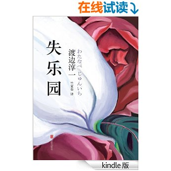
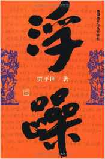
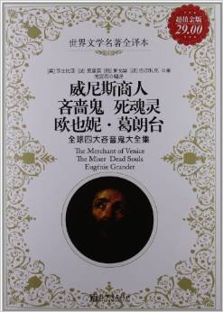
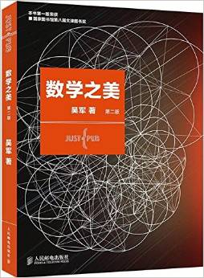
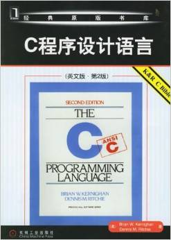
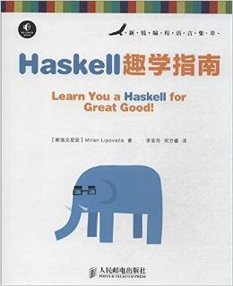
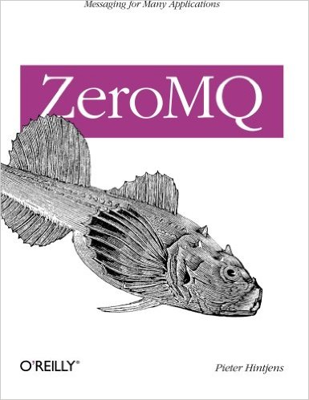
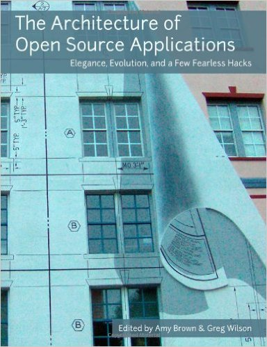

# Q4

## Literature
1. **《失乐园》** 4.5/5.0

  > 渡边淳一

  > 1997

  <p align="center"></p>

  本来想买的是18世纪弥尔顿的名著《失乐园》, 凑单的时候没仔细看,买回来才发现是一部日本小说。

  -----------------------------------------------------------------------

  渡边淳一情爱小说代表作，超级畅销书。

  《失乐园》是一部梦幻与现实、灵与肉、欢悦与痛楚相互交织的震撼心灵的杰作。
  奇妙的心理活动与错综复杂的感情纠葛，溶入到异域特有的四季更迭的绮丽环境里，
  令人回肠荡气。《失乐园》在日本出版后曾长期雄踞畅销书排行榜榜首，
  改编成同名电影和电视剧上演后家喻户晓，形成所谓“失乐园现象”。

1. **《浮躁》** 4.0/5.0

  > 贾平凹

  > 1986

  <p align="center"></p>

  这是看过的贾平凹的第二本小说，第一本是《废都》。

  1987年《收获》第一期发表贾平凹的第一部长篇小说《浮躁》，同年9月，作家出版社
  出版单行本。小说取名浮躁，试图表现那个时期经济变革大潮带来的浮躁风气，人们的
  行为、心理和价值取向都陷入浮躁之中。我们可以感受到社会各阶层都在渴望着一种
  新生活。

  《浮躁》是贾平凹36岁之前写作风格的终结。写完《浮躁》，贾平凹认识到“我再也
  不可能以这种框架构写我的作品了”.

  他在序言二里说“一位画家曾经对我评述过他
  自己的画：**他力图追求一种简洁的风格，但他现在却必须将画面搞得很繁很实，
  在用减法之前而大用加法**。我恐怕也是如此，必须先写完这部作品了，
  因为我的哲学意识太差，生活底气不足，技巧更是生涩，我必要先踏着别人的路子走，
  虽然这条路上已有成百上千的优秀作家将其了不起的作品放在了我的面前。
  于是，我是认真来写这部作品的，企图使它更多混茫，更多蕴藉，
  以总结我以前的创作，且更有一层意义是有意识在这一部作品里修我的性和
  练我的笔，扼制在写到一半时之所以心态浮躁正是想当文学家这个作祟的鬼欲望，
  而冲和、宽缓。可以说，我在战胜这部作品的同时也战胜了我。”。

  这个版本的《浮躁》前面还附带了3篇总共50来页、非常有深度的文学评论，探讨了
  贾平凹从《浮躁》到《废都》再到《秦腔》的艺术道路和中国当代文学史的变迁，
  让本书更加物超所值。

  ---------------------------

  贾平凹素有“鬼才”之称，是纯文学“最后的大师”，也是乡土文学“最后的大师”。


1. **《欧洲四大吝啬鬼合集》**

  * 《威尼斯商人》之夏洛克, 莎士比亚, 英国
  * 《吝啬鬼》之阿巴贡, 莫里哀, 法国
  * 《死魂灵》之蒲柳什金, 果戈里, 俄国
  * 《欧也妮葛朗台》之葛朗台, 巴尔扎克, 法国

  <p align="center"></p>

  1. ***The Merchant of Venice***, 4.5/5.0

    > William Shakespeare

    莎士比亚最著名的话剧之一.

    情节中学语文课本里就读到过, 好人安东尼奥为了帮朋友, 向坏人夏洛克借了一些钱.
    契约里规定如果不能按期偿还,夏洛克就要从安东尼奥身上割一磅肉.后来安东尼奥
    果然未能及时还款,但他的朋友回来帮忙, 提出可以加倍偿还, 但是夏洛克坚持要从
    安东尼奥身上割一磅肉. 最后"机智的法官"提出,割一磅肉可以, 但是契约里没有
    说可以取安东尼奥的血, 所以你可以割一磅肉, 不能多也不能少,
    而且还不能让安东尼奥流血. 安东尼奥和他的朋友们最后"反败为胜".

    但是以上的版本省略了太大东西: 好人没有那么无条件的好,
    坏人夏洛克也不是无缘无故的坏.

    先说夏洛克, 其实他并不是通常所说的吝啬鬼的形象, 至少跟其他三部著作里的吝啬鬼相比,
    , 最多只是个贪婪的资本家.他并非唯利是图,为了钱不择手段, 所以最后当安东尼奥提出以十倍,
    二十倍的数目赔偿违约金的时候, 他说**"即使把整个威尼斯给我也不要, 我一定要割他一磅肉"!**
    那么, 他为什么这么恨安东尼奥?

    首先, 这部作品里有很明显的种族和宗教歧视:只因夏洛克是犹太人和异教徒,
    就被周围的基督徒视为贪婪和异类.
    虽说夏洛克放高利贷名声不佳, 但是安东尼奥在公共场合辱骂他,朝他身上吐吐沫,
    踹他, 也很难称得上绅士. 对此, 夏洛克只是忍气吞声.

    其次, 在审判之前发生了一件更重要的事: 安东尼奥的朋友把夏洛克的女儿拐跑了,
    而且他女儿还偷走了他大量的珠宝和钱物. 这让夏洛克暴跳如雷.
    所以不难理解为什么最后拒绝二十倍的违约金赔偿,
    说"即使把整个威尼斯给我也不要, 我一定要割他一磅肉".
    他这时表现的愤怒是可以理解的. 当然, 坚持要血腥割肉, 还是不太好的.

    最后安东尼奥一众基督徒在"法官"的帮助下反败为胜, 并且法官判定夏洛克作为
    异邦人蓄意杀害威尼斯本国公民, 他的财产一半归安东尼奥, 一半充公.
    安东尼奥提出了"宽宏大量"的条件, 说一半的财产我可以不要, 但是"夏洛克必须立即改
    信基督". 这种强迫他人更改宗教信仰还被视为美好品德加以赞扬, 也是醉了.

    此外, "法官"也不是真正的法官, 是安东尼奥朋友的老婆冒出的, 此人也是颇有心机 ...

    总之, **语文课本就像新闻联播**...

  1. ***The Miser***, 5.0/5.0

    > Molière (France)

    莫里哀的话剧. 情节节奏, 冲突安排的非常巧妙. 对主人公阿巴贡的吝啬鬼形象刻画的入木三分.

    列举一二:

    ```
    1. 别人恭维阿巴贡长寿时说到"除非有人把你打死, 不然你是死不了的,
    你还要为你的孩子送终, 还要为你的孩子的孩子送终". 阿巴贡听到之后竟然说
    "这太好了!", 因为他的钱就不会被他的孩子抢走了.

    2. "他吝啬到就是向人表示礼貌地说句客气话, 都会忌讳用一个子, 那就是'送',
    他从来不会说'我送你一个美丽的早晨'. 而是说,'我借你一个美丽的早晨'"

    3. 请客的时候, 向管家吩咐"多准备一些大家看见了就不想吃, 但是吃一点就饱了的食物"

    4. 为了能让自己家上上下下少吃一点粮食, 自己制作一个特别的日历,
    把一年的斋日加长几倍, 这样家里就可以多吃几天素, 多省几个钱.

    5. 为了让马少吃一点料, 半夜去马棚偷荞麦 (结果被马夫当贼痛打一顿, 只能自认倒霉).
    ```

  1. ***Dead Souls***, 4.5/5.0

    > Nikolai Vasilievich Gogol (Russia)

    故事发生在俄国农奴制时期. 那时地主每隔七年至十年须将农奴的名单呈交政府,
    以便政府征收人头税. 纳税登记册上的纳税农奴数至下次纳税前不变.
    这就是说, 如果注册了100个农奴, 接下来一部分农奴死掉了, 那到下次注册前,
    仍然要为这部分农奴交税.
    在俄语中, '魂灵'亦可指'农奴'. 所以死魂灵也双关地指死农奴.

    故事的主人公就是周游各地找地主, 买已经死掉但仍然注册在案的农奴.
    那么, 他买过来这些dead soul做什么呢? 有兴趣的可以去看看这本书.

    另外, 故事的吝啬鬼并不是主人公乞乞科夫, 而是乞乞科夫拜访的地主之一蒲柳什金, 配角之一.


  1. ***Eugenie Grandet***, 5.0/5.0

    > Honoré de Balzac (France)

    印象里, 《欧也妮葛朗台》是我看过的第二部外国小说, 第一部是《鲁滨逊漂流记》.
    从那时起就喜欢上了这个法国作家: 巴尔扎克.

    许多年以后, 在语文课上学到了巴尔扎克, 杰出的现实主义作家,
    《欧也妮葛朗台》也被认为是他的法国全景式巨著《人间喜剧》中的代表作.
    巴尔扎克对于人物的刻画入木三分, 所以即使在十几年以后, 我仍然清晰的记得一些
    吝啬鬼葛朗台老头的桥段, 比如已经是家财万贯,省城首富,
    一个戴手套的举得都被整个城市解读为"葛朗台先生戴上了手套, 今年入冬比平时早,
    葡萄酒要早卖还是晚卖"这样的影响力的时候, 仍然住在破旧阴冷的房子里,
    一年只要最冷的时候才允许壁橱生几天火, 每顿饭的面包都是自己亲自从仓库里拿
    出来切给每个人, 并且还不让吃饱; 楼梯踏板被虫蛀以致踩断了差点把人摔倒时,自己拿起
    锤子木板修补;等等.

## Science, Philosopy, Economics
1. **《数学之美》** (***Beauty of Mathematics***) 4.5/5.0

  > 吴军

  > 2012, 2nd edition

  <p align="center"></p>

  这本书在我不同的桌子上一共躺了两年多，终于在这次十一回家的路上把它看了。
  现在想想，当初的数学可真是体育老师教的。

  -----------------------------------------------------------------------

  我大学的专业是计算数学，但读到吴军老师的“数学之美”系列文章，才发现马尔可夫链、
  矩阵计算，甚至余弦函数原来都如此亲切，并且栩栩如生；才发现自然语言和
  信息处理这么有趣；才真正明白“数学是科学的皇后”这句名言。相信认真读完这本《数
  学之美》的朋友们，算法功力都会暴涨N倍，更重要的是发现了数学背后的无穷
  魅力，学会欣赏数学之美。 ——蒋涛／CSDN＆《程序员》创始人

  最初看到“数学之美”，是谷歌黑板报上的连载文章。里面的公式并不是很多，
  但是很多看似颇为复杂的概念，吴军老师却能够如讲故事般娓娓道出，
  着实看出作者对这些问题有着深入且独到的见解，读后受益匪浅。——张磊／微软亚洲研究院主管研究员

  第一次接触吴军老师的“数学之美”系列，是在搜索bloom filter资料时，
  读了其中一篇后，就把其他的文章都读了，感触很多：
  首先，改变了观点，原以为在计算机系学到的数学基础在工作中一无是处，
  现在懂得，知识要落地，最重要的是理解知识的由来：其次，任何复杂的问题最终
  可以用简单的方式去解决，我们往往会陷入不断给问题增加难度的复杂解法，
  而忽视了简单直接有效的方法。“数学之美”系列文章，整体和细节的度把握得很好，
  通过具体的例子让读者学到的是思考问题的方式，同时留了很多问题给愿意
  钻研的人做进一步深入思考。BTW，“数学之美”系列，是我在技术领域介绍中读过的
  最好的文章之一，让人学会如何化繁为简，如何用数学去解决工程问题，
  如何跳出固有思维不断去思考创新。 ——岑文初／某网开放平台技术产品负责人

## Technology
1. ***C Programming Language*** 5.0/5.0

  > Brian W. Kernighan, Danies Ritche

  > 1986, 2nd edition

  <p align="center"></p>

  **K & R C, the C Bible**

  在用c做了几年开发之后,有一天突然发现还从来没看过c语言之父写的c教科书,
  顿时为c技能长进缓慢找到了原因...
  个人觉得,想在某个领域有深入研究, 关于该领域的三类材料(paper/book/tutorial/...)是必需要看的:
  - 该领域的最早的资料(尤其是创立这门学科的paper or something),
  - 该领域最重要的资料(发展过程中经过积淀,公认的一些经典paper/book),
  - 以及该领域的最新的资料(最新动向).

  毫无疑问,我竟然连祖师爷的教诲都没看就开始c coding了...而且是好多年.

  回到正题.
  c是一门相当简单的语言, **按Ritchie的说法, c语言不是一门大型语言, 所以也不需要一本很厚的书来描述**.
  c programming language正是这种思想的体现, 不厚, 但是精华尽在其中.
  基本的概念表达的相当简洁,示例恰到好处.
  反观一些故弄玄虚的c语言教程(尤其是国内一些为了赚钱/课题/评奖而胡编乱抄的教程),
  浪费钱不说,还耽误时间,看不懂而打击自信心, 简直是罪大恶极.记得以前读书的时候,
  刘超老师就说过**国内的书大部分都不应该写xxx著,xxx编,而应该写xxx抄**.

  关于c语言简单这个话题, 不管是以前在学校还是在公司,偶尔都会感觉到
  c的东西都会了,任何功能不管是小程序还是比较大的系统,我都可以用c实现.
  但是和一些优秀的实现比(尤其是开源的项目),
  一眼就可以看出差距,爆棚的自信心在几行惊为天启的code前面瞬间就被踩在脚下.
  而进阶之路,只是大概觉得**要多看好代码,就像作家要多看好书一样**,
  这种想法没错,但失于宽泛,不知具体的差距差距在哪里,以及怎么补.

  在读这本书的过程中,
  终于发现了一条补救之路: **标准库**.粗略回顾一下以前写的程序就会发现,
  自己写了很多messy code封装成函数用,其实类似或者功能完全一样的函数
  已经在标准库里提供了.以前总是抱怨c的标准库很少(特别和python这样无门槛的语言比),
  其实都是主观臆断和人云亦云.c的库的确比python少,但是感觉它少的更重要的原因是,我可能只用过30%都不到.
  剩下的70%如果用到了,都是自己实现一个蹩脚的版本 - 因为我根本不知道标准库里有它.
  看标准库的另一个好处就是:标准库一般都是该语言的最地道的实现,你会在惊讶原来程序还可以这样写中学到太多东西.

  ***Stay Hungry, Stay Foolish!***

  **最后说一句,这本书是冲着影印版才买的,结果还真是"影印": 印刷相当不专业,
  就像自己拿pdf去复印店打印出来的一样.**


1. ***Learn You A Haskell for Great Good*** 4.5/5.0

  > Miran Lipovaca

  > 2011

  <p align="center"></p>

  **维特根斯坦说,语言的界限就是一个人世界的界限**.
  相较与命令式语言(c/c++/java/python/...),
  以haskell为代表的函数式语言能给人打开一个全新的世界, 让人脑洞大开.

  另外还有一个大牛说过,**不能改变你思维方式的语言是不值得学习的**. 以此而论,
  haskell绝对值得一学.

  -----------------------------------------------------------------------

  此书理论不深, 很适合作为第一本入门书 .

  **The Author**: Miran Lipovaca is a computer science student in Ljubljana,
  Slovenia. His [online tutorial](learnyouahaskell.com), "Learn You a Haskell for Great Good!,"
  is widely regarded as the best way to learn Haskell.
  Here is [the Chinease version](http://learnyoua.haskell.sg/) or
  [another site](http://fleurer-lee.com/lyah/chapters.htm) (only first 8 chapters).

1. ***ZeroMQ: Messaging for Many Applications*** 5.0/5.0

  > Pieter Hintjens

  > 1st edition, 2013

  <p align="center"></p>

  ZeroMQ is recognized as the fastest message queue, and it's ambition is
  to be merged into the Linux Kernel, replace the out-of-date (designed back
          at 1980s) raw socket.

  About this Book: this book is remarked as one of the best books/tutorials on message
  queue (and more generally, distributed system) design. Any distributed system
  designer is recommended to read it, thoroughly. This is the
  [online version](http://zguide.zeromq.org/).

  -----------------------------------------------------------------------

  About the Author:

  Pieter Hintjens started his first business making video games 30 yearsago
  and has been building software products since then. Taking as his principle,
  ***"the real physics of software is the physics of people"***, he focuses
  now on building communities through "Social Architecture",writing,
  and helping others use ZeroMQ profitably.

  About ZeroMQ:

  ØMQ (also spelled ZeroMQ, 0MQ or ZMQ) is a high-performance messaging
  library, aimed at use in scalable distributed or concurrent applications.
  It provides a message queue, but unlike message-oriented middleware,
  a ØMQ system can run without a dedicated message broker.
  The library is designed to have a familiar socket-style API.

  ØMQ is developed by a large community of contributors, founded by iMatix,
  which holds the domain name and trademarks.
  There are third-party bindings for many popular programming languages.

1. ***The Architecture of Open Source Applications*** 4.0/5.0

  > 2012

  <p align="center"></p>

  更像是每个产品的架构和功能介绍,关于软件架构设计和实现的干货不多.
  算是科普读物吧.

  ------------------------------------------------------------------------

  Architects look at thousands of buildings during their training,
  and study critiques of those buildings written by masters.
  In contrast, most software developers only ever get to know a handful of
  large programs well - usually programs they wrote themselves - and never
  study the great programs of history. As a result, they repeat one
  another's mistakes rather than building on one another's successes.

  This book's goal is to change that. In it, the authors of twenty-five
  open source applications explain how their software is structured, and why.
  What are each program's major components? How do they interact?
  And what did their builders learn during their development?
  In answering these questions, the contributors to this book provide unique
  insights into how they think.

---------------------------------------------------
  [Previous: 2015 Q3](2015_Q3.md)
