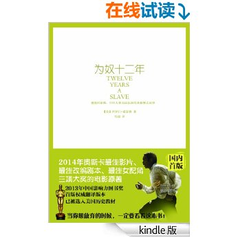

# Q1
## Literature & Social Science
1. **《为奴十二年》** (***Twelve Years A Slave***), 4.0/5.0

  > Solomon Northup

  > first published 1860s

  

  **亚马逊书评**：

  《为奴十二年》讲述了美国内战前夕，一位受过高等教育、为人正直、会拉小提琴的
  纽约自由黑人不幸被绑架并贩卖为奴隶。十二年的奴隶生活，历经磨难，
  最终回到了家园的故事。这种距离我们非常遥远，但只要一读，
  那种莫名的熟悉感就会扑面而来的故事，这也是为什么它写的是一段美国的历史，
  但却在2014年撼动了整个世界电影圈的原因。因为《为奴十二年》中那些
  关于坚守生命、自由、尊严和信念的决心和执著，让人无法回避。
  它在奋力地为爱与亲情、为回家而抗争，它让冰冷的现代人潸然泪下。
  世界名著《汤姆叔叔的小屋》中的许多情节取材于这个故事，在回家的漫漫长路上，
  无论时间，无论岁月，也无论地点，你、我、他都是一样的……

## Science & Technology, Philosopy
1. **《从0到1》** (***Zero to One***: Notes on Startups, or How to Build the Future), 4.5/5.0

  >  Peter Thiel, Blake Masters

  > 2014, 1st edition

  

  一位传奇的创投教父，一部开启秘密的商业之作，一部事关所有人的生存哲学：
  《从0到1》作者彼得•蒂尔为首的“PayPal黑帮”开创了硅谷的新格局，
  他是Facebook首位外部投资人，投资了Tesla、LinkedIn、SpaceX、Yelp等企业。
  他创立的数据分析公司Palantir市值约150亿美元。

  《从0到1》揭开创新的秘密，纠正创业上的众多偏见：

  * 创新不是从1到N，而是从0到1
  * 全球化并不全是进步
  * 竞争扼杀创新
  * “产品会说话”是谎言
  * 失败者才去竞争，创业者应当选择垄断
  * 创业开局十分重要，“频繁试错”是错误的
  * 没有科技公司可以仅靠品牌吃饭
  * 初创公司要打造帮派文化

## Technical

---------------------------------
  [Next: 2016 Q2](2016_Q2.md)
