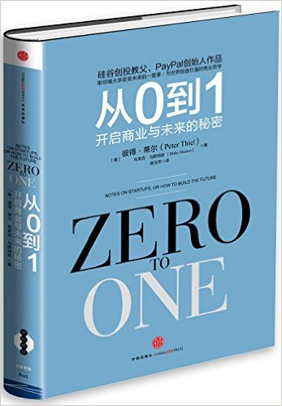

# Q1
## Literature & Social Science

## Science & Technology, Philosopy
1. **《从0到1》** (***Zero to One***: Notes on Startups, or How to Build the Future), 4.5/5.0

  >  Peter Thiel, Blake Masters

  > 2014, 1st edition

  

  一位传奇的创投教父，一部开启秘密的商业之作，一部事关所有人的生存哲学：
  《从0到1》作者彼得•蒂尔为首的“PayPal黑帮”开创了硅谷的新格局，
  他是Facebook首位外部投资人，投资了Tesla、LinkedIn、SpaceX、Yelp等企业。
  他创立的数据分析公司Palantir市值约150亿美元。

  《从0到1》揭开创新的秘密，纠正创业上的众多偏见：

  * 创新不是从1到N，而是从0到1
  * 全球化并不全是进步
  * 竞争扼杀创新
  * “产品会说话”是谎言
  * 失败者才去竞争，创业者应当选择垄断
  * 创业开局十分重要，“频繁试错”是错误的
  * 没有科技公司可以仅靠品牌吃饭
  * 初创公司要打造帮派文化

## Technical

---------------------------------
  [Next: 2016 Q2](2016_Q2.md)
