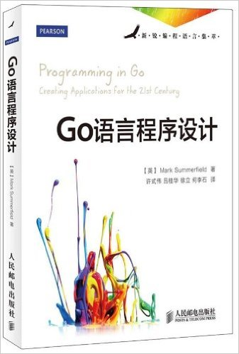
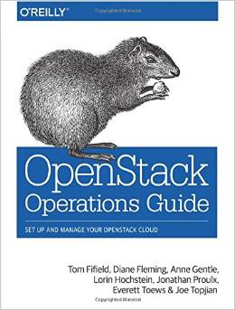

# Q1
## Literature & Social Science
1. **《为奴十二年》** (***Twelve Years A Slave***), 4.0/5.0

  > Solomon Northup

  > first published 1860s

  

  **亚马逊书评**：

  《为奴十二年》讲述了美国内战前夕，一位受过高等教育、为人正直、会拉小提琴的
  纽约自由黑人不幸被绑架并贩卖为奴隶。十二年的奴隶生活，历经磨难，
  最终回到了家园的故事。这种距离我们非常遥远，但只要一读，
  那种莫名的熟悉感就会扑面而来的故事，这也是为什么它写的是一段美国的历史，
  但却在2014年撼动了整个世界电影圈的原因。因为《为奴十二年》中那些
  关于坚守生命、自由、尊严和信念的决心和执著，让人无法回避。
  它在奋力地为爱与亲情、为回家而抗争，它让冰冷的现代人潸然泪下。
  世界名著《汤姆叔叔的小屋》中的许多情节取材于这个故事，在回家的漫漫长路上，
  无论时间，无论岁月，也无论地点，你、我、他都是一样的……

1. **《生如夏花 - 泰戈尔经典诗选》** (***The Crescent Moon*** + ***Stray Birds***), 4.5/5.0

  > Tagore

  > first published 1916

  

  前一段时间关于《飞鸟集》的话题重新火了起来，起因是冯唐重新翻译了一版，
  而风格一如他的随笔，
  充满了浓重的中年荷尔蒙味道，比如下面这句最有代表性的：

  > 大千世界在情人面前解开裤裆,绵长如舌吻,纤细如诗行
  >
  > The world puts off its mask of vastness to its lover.
  It becomes small as one song, as one kiss of the eternal.

  这已经不能用传统的“信雅达”标准来评判了，而只能认为是以原著为蓝本进行的二次
  创作。虽然冯版备受非议与攻击，但是作为成年读者偶尔看看这么骚气的翻译，
  也还是挺有意思的,不要去祸害青少年就行了。
  冯金线虽然是流氓，但毕竟也是比绝大多数人有文化的流氓。

  ------------------

  跑题了，这本书并不是冯唐版，而是郑振铎先生的原版翻译，注重诗歌之美。
  读诗心绪一定要对，不然读着很无趣，所以之前读过一点就放弃了，
  这本书在床头扔了半年，最近心绪到了，才重新捡起。洗涤一下心灵吧。

  泰戈尔果然是大师，非常惊讶于其诗中**超凡的想象力**, 这种感觉不亚于看到一段
  惊为天启的代码时带来的震撼。

  -------------

  **编辑推荐**：

  图文美绘双语典藏，《新月集》+《飞鸟集》，清新演绎生命与诗歌最美丽的相遇，郑振铎优美译文。再现泰戈尔笔下灵性的芬芳.

## Science & Technology, Philosopy
1. **《从0到1》** (***Zero to One***: Notes on Startups, or How to Build the Future), 4.5/5.0

  >  Peter Thiel, Blake Masters

  > 2014, 1st edition

  

  一位传奇的创投教父，一部开启秘密的商业之作，一部事关所有人的生存哲学：
  《从0到1》作者彼得•蒂尔为首的“PayPal黑帮”开创了硅谷的新格局，
  他是Facebook首位外部投资人，投资了Tesla、LinkedIn、SpaceX、Yelp等企业。
  他创立的数据分析公司Palantir市值约150亿美元。

  《从0到1》揭开创新的秘密，纠正创业上的众多偏见：

  * 创新不是从1到N，而是从0到1
  * 全球化并不全是进步
  * 竞争扼杀创新
  * “产品会说话”是谎言
  * 失败者才去竞争，创业者应当选择垄断
  * 创业开局十分重要，“频繁试错”是错误的
  * 没有科技公司可以仅靠品牌吃饭
  * 初创公司要打造帮派文化

## Technical
1. ***Programming in Go***, 4.5/5.0

  > Mark Summerfield

  > 2012

  

  Creating applications for 21st century!

  Perhaps the significant difference of Go and other morden languages is that Go
  is created to solve the most chanllenging (huge distributed system,
  multi-language programming, massive parrallel/concurrentcy, fast/easy
  debugging/minitoring/maintaining/, etc) problems Googled faced, so it is an
  engineering-oriented language, not an academic-oriented one, the latter may
  focus more on researching purposes.

  This article summaries some of the background and characteristics of Go, as
  well as why Go is created:
  [谢孟军：我为什么选择使用Go语言？](http://mp.weixin.qq.com/s?__biz=MzA4NTU2MTg3MQ==&mid=405835997&idx=1&sn=50bbe18cadbebdc71f555b0463d039e6&scene=0#wechat_redirect)

  The first time i heard about Go was 4 or 5 years ago when I was still at
  shcool.  I regarded it nothing more than yet another toy language
  (embrassing).  One year ago, when i was learning Docker, a Principal Engineer
  colleague suggested me to take a look at Go, and said that this is an
  interesting language. But totally addicted into Python then, i missed it
  again.

  After finish reading this book, I come to agree on what i used to opposing: if
  there is any language so far that inherites and out-performs C and makes
  itself better than C, it is Go.

  Have fun with Go!

1. ***Programming in Lua***, 4.5/5.0

  > Roberto Ierusalimschy

  > 2013, 3rd Edition

  

  Simple, powerful, beautiful embedded language!

  The first time i want to learn Lua was when I heard the totally language is
  written in pure ANSI C, in less than 20K lines. Amazing! And the entire lua
  interpreter - in 500 lines!

  After scanning the source code of Lua implementation (5.2), I was totally
  shocked by its beauty. Some people say that Lua should be the second language
  students should learn (C should definitly be the first one). In that way,
  you will learn how to design and implement a new powerful language in C.

  A quote of Lua and C comparison:

  > Lua does not try to do what C is already good for, such as sheer-performance,
  low-level operations, and interface with third-party softwares. Lua relies on
  C for these tasks. What Lua does offer is what C is not good for: a good distance
  from hardware, dynamic structures, no redundancies, and ease of testing and
  debugging.

1. ***Openstack Operations Guide***, 3.5/5.0

  > Tom Fifield, Diane Fleming, Anne Gentle, Lorin Hochstein, Jonathan Proulx

  > 2016

  

  A general guide on designing, deploying, and maintaining your own private or
  public Infrastructure as a Service (IaaS), using the open source OpenStack
  platform.

  It talks about how to build clouds based on reference architectures,
  as well as how to perform daily administration tasks.

  **The discussions are somewhat general, reveal little details and stories at
  the back of the design - Just like most of the openstack official documents.**

  [This](http://docs.openstack.org/ops/) is the online version.

---------------------------------
  [Next: 2016 Q2](2016_Q2.md)
