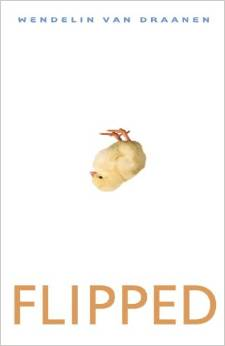
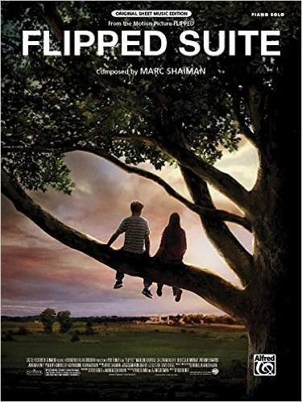
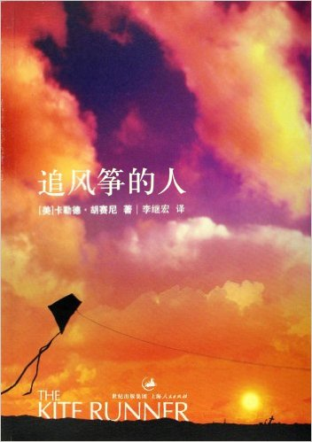

# Q2

## Literature & Social Science
1. ***Flipped***, 5.0/5.0

  > Wendelin Van Draanen

  > 2003

  
  

  > Ever since watched this movie at school several years ago, i got flipped
  with this story! The movie is a faithful replay of the orignal book at
  great extent, but the book reveals more, and more importantly, the ending
  it a little different, what know more? Read the book!

  > There is no trouble to read the original (English) version, the author
  uses simple words and sentences, which matches the ages of the boys and girls
  in the book. However, it still turns out to be excellent in rhetoric.

  > ----------------------

  > The first time she saw him, she flipped. The first time he saw her, he ran.
  That was the second grade, but not much has changed by the seventh.
  She says: “My Bryce. Still walking around with my first kiss.”
  He says: “It’s been six years of strategic avoidance and social discomfort.”
  But in the eighth grade everything gets turned upside down.
  And just as he’s thinking there’s more to her than meets the eye,
  she’ s thinking that he’s not quite all he seemed.

  > This is a classic romantic comedy of errors told in alternating chapters
  by two fresh, funny voices. Wendelin Van Draanen is at her best here with a
  knockout cast of quirky characters and a hilarious series of
  misunderstandings and missed opportunities.
  But underlying the humor are two teens in transition.
  They are each learning to look beyond the surface of people,
  both figuring out who they are, who they want to be, and who they want to be with.

  > *From the Hardcover edition.*

1. **《追风筝的人》** (***Kite Runner***), 5.0/5.0

  > Khaled Hosseini

  > 2005

  

  > 利用周末看完了这本听闻已久的书。
  > 之前好多同学推荐过，一个朋友还说，特意趁着去英国的时候买了一本原版的回来，
  所以我一直误以为这本小说写的是发生英国的故事。

  > 小说发生在两个地方，阿富汗和美国，大部分剧情都是在阿富汗；时间跨度大概为
  40年，讲述的是一个阿富汗裔美国人，在一天突然接到一个巴基斯坦打来的电话，
  揭开了自己极力不想再面对的一些往事，然后开始的一段前往阿富汗的自我救赎之旅。
  融合了爱恨、嫉妒、种族、战争、宗教、人性、救赎。。。

  > 然后说说小说的名字，**追风筝的人**，看了书才知道，**追风筝**其实是阿富汗的
  一个传统盛大活动：每年都会在特定的时候举行斗风筝大赛，大家竞相施展绝技，
  用自己的线把别人的风筝线隔断，最后剩下的那个，就是胜者。
  同时，大家会竞相追逐战利品 —— 那些被隔断线而掉下来的风筝 —— 尤其是亚军的
  那个风筝，这些风筝会被追到的人挂在家里最显眼的位置，视作一种无上的荣耀。

  > -------------

  > “这本小说太令人震撼，很长一段时日，让我所读的一切都相形失色。
  > 文学与生活中的所有重要主题，都交织在这部惊世之 作里：爱、恐惧、愧疚、赎罪……”
  > —— 伊莎贝拉·阿连德说

## Science & Technology, Philosopy

## Technical

1. ***KVM虚拟化技术***, 4.0/5.0

  > 任永杰，单海涛

  > 2013

  

  一本关于KVM的入门级书籍。介绍了基本的KVM原理，特点，并以较大的篇幅介绍了具体
  的安装/测试过程，副有大量插图。

  可以作为KVM和虚拟化技术的扫盲读物。

------------------------------------------------------
  [Previous: 2016 Q1](2016_Q1.md)          [Next: 2016 Q3](2016_Q3.md)
