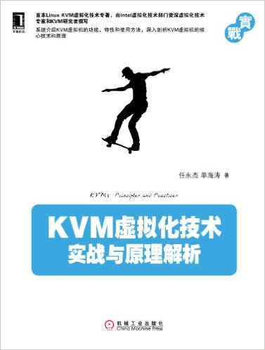

# Q2

## Literature & Social Science

## Science & Technology, Philosopy

## Technical

1. ***KVM虚拟化技术***, 4.0/5.0

  > 任永杰，单海涛

  > 2013

  

  一本关于KVM的入门级书籍。介绍了基本的KVM原理，特点，并以较大的篇幅介绍了具体
  的安装/测试过程，副有大量插图。

  可以作为KVM和虚拟化技术的扫盲读物。

------------------------------------------------------
  [Previous: 2016 Q1](2016_Q1.md)          [Next: 2016 Q3](2016_Q3.md)
