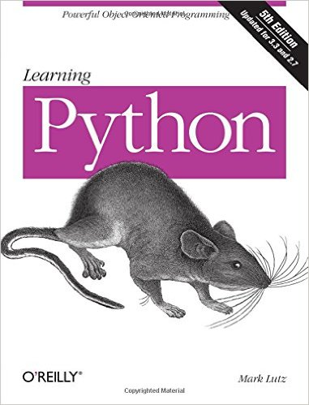

# Q2

## Literature & Social Science
1. ***Flipped***, 5.0/5.0

  > Wendelin Van Draanen

  > 2003

  
  

  Ever since watched this movie at school several years ago, i got flipped
  with this story! The movie is a faithful replay of the orignal book at
  great extent, but the book reveals more, and more importantly, the ending
  it a little different, what know more? Read the book!

  There is no trouble to read the original (English) version, the author
  uses simple words and sentences, which matches the ages of the boys and girls
  in the book. However, it still turns out to be excellent in rhetoric.

  > ----------------------

  > The first time she saw him, she flipped. The first time he saw her, he ran.
  That was the second grade, but not much has changed by the seventh.
  She says: “My Bryce. Still walking around with my first kiss.”
  He says: “It’s been six years of strategic avoidance and social discomfort.”
  But in the eighth grade everything gets turned upside down.
  And just as he’s thinking there’s more to her than meets the eye,
  she’ s thinking that he’s not quite all he seemed.

  > This is a classic romantic comedy of errors told in alternating chapters
  by two fresh, funny voices. Wendelin Van Draanen is at her best here with a
  knockout cast of quirky characters and a hilarious series of
  misunderstandings and missed opportunities.
  But underlying the humor are two teens in transition.
  They are each learning to look beyond the surface of people,
  both figuring out who they are, who they want to be, and who they want to be with.

  > *From the Hardcover edition.*

1. **《追风筝的人》** (***Kite Runner***), 5.0/5.0

  > Khaled Hosseini

  > 2005

  

  利用周末看完了这本听闻已久的书。
  之前好多同学推荐过，一个朋友还说，特意趁着去英国的时候买了一本原版的回来，
  所以我一直误以为这本小说写的是发生英国的故事。

  小说发生在两个地方，阿富汗和美国，大部分剧情都是在阿富汗；时间跨度大概为
  40年，讲述的是一个阿富汗裔美国人，在一天突然接到一个巴基斯坦打来的电话，
  揭开了自己极力不想再面对的一些往事，然后开始的一段前往阿富汗的自我救赎之旅。
  融合了爱恨、嫉妒、种族、战争、宗教、人性、救赎。。。

  然后说说小说的名字，**追风筝的人**，看了书才知道，**追风筝**其实是阿富汗的
  一个传统盛大活动：每年都会在特定的时候举行斗风筝大赛，大家竞相施展绝技，
  用自己的线把别人的风筝线隔断，最后剩下的那个，就是胜者。
  同时，大家会竞相追逐战利品 —— 那些被隔断线而掉下来的风筝 —— 尤其是亚军的
  那个风筝，这些风筝会被追到的人挂在家里最显眼的位置，视作一种无上的荣耀。

  -------------

  > “这本小说太令人震撼，很长一段时日，让我所读的一切都相形失色。
  > 文学与生活中的所有重要主题，都交织在这部惊世之 作里：爱、恐惧、愧疚、赎罪……”
  > —— 伊莎贝拉·阿连德说

1. **《古典音乐的巨匠时代》** 4.0/5.0

  > 田艺苗

  > 2014,1

  

  > 《古典音乐的巨匠时代》是一本面向大众的古典音乐知识普及书。
  从最经典的、大家最熟悉的音乐和音乐家写起——从巴赫（J.S.Bach）到勃拉姆斯
  （Brahms），从1685到1897年——以12位巨匠的故事为入口，
  系统讲述了古典音乐最辉煌的岁月。

## Science & Technology, Philosopy
1. **《胡希恕金匮要略讲座》** 4.5/5.0

  > 胡希恕

  > 2011年6月1日, 第1版

  

  中医四大经典：《黄帝内经》、《伤寒论》、《金匮要略》、《温病条辨》。

  张仲景(东汉)的《金匮要略》是现存最早的一部诊治杂病的中医专著。
  这本书是根据胡希恕先生讲授此课的录音整理出来的。

  读《金匮要略》最好有点伤寒论的基础知识，胡老先生也说：

  > "《金匮要略》这个书不像《伤寒论》讲的那么具体，因为你有了一般的知识了，
  有了一般的对于辩证施治的认识了，所以就是一个纲领而已"

  不过没看过伤寒论的话，很多东西也能看懂，我之前也没看过其他的中医书。

  即使是这样一本纲领性的书，也比较清晰的显现了中医辩证施治的特点和完善
  的体系。中医首先认为，人体是一个五官四肢五脏六腑相互联系和影响的有机整体,
  看病应该着眼于整体而不能局限于局部病处，要分析真正的病因(root cause)，
  方能治本(用程序员的话说，应该解决**问题**而不是解决**现象**)。

  书中对于一些病因的分析很好的体现了这一思想，例如,对风湿性关节炎的论述：
  人在出汗的时候如果吹到冷风(**汗出当风**)导致体表闭塞，本应从皮肤排出的汗就会郁结
  在体表内，这些湿气就会在体内游动，并往间隙大的地方游走。哪里间隙大呢？
  关节的结合处！所以慢慢的这些含有毒素的湿气就会郁结在关节处，引起关节发炎，
  形成关节炎, 故名**风湿**性关节炎。
  并且空气中湿气重的时候，体内湿气更不容易排出，因此发作的更厉害。
  这就是为什么患有风湿性关节炎的人可以根据自己的感觉预测天要下雨。

  对于五脏六腑的联系和分析，则更为精妙！让人明白为什么很多时候头痛不医头，脚痛不医脚。
  中医博大精深！强烈推荐！

  ----------

  胡老一生于生活淡泊名利，于学术精益求精，于患家尽心尽责，于弟子子女
  严格要求，其坚毅质朴于师长处每多闻及。今闻其声，亦想见其为人，如身临其境，
  亲奉先生之教，虽未若狂，实亦欣喜至极。
  这些录音的内容是胡老生平最后一次系统讲解《伤寒杂病论》，
  此时胡老学术思想已处于成熟期，理论与临床造诣已臻化境，尤能深入浅出地娓娓
  道来。其真知灼见在讲课录音中处处闪现，贯穿始终。如同天上的颗颗明星，汇成灿烂瀚海。

## Technical

1. ***KVM虚拟化技术***, 4.0/5.0

  > 任永杰，单海涛

  > 2013

  

  一本关于KVM的入门级书籍。介绍了基本的KVM原理，特点，并以较大的篇幅介绍了具体
  的安装/测试过程，副有大量插图。

  可以作为KVM和虚拟化技术的扫盲读物。

1. **《企业应用架构模式》** (***Patterns of Enterprise Application Architecture***)

  > Matin Fowler

  > 终于明白企业应用是个什么术语了。

1. ***Learning Python***

  

  > I think i know more python than before...

1. ***Programming PHP***, 4.5/5.0

  > Kevin Tatroe, Peter MacIntyre, Rasmus Lerdorf

  > O'Reilly Media; 3 edition (February 25, 2013)

  

  PHP maybe the most controversial programming language in this world.

  **"PHP is the best programming lanuguage in the world"** - some programmers
  takes this seriously, and they really mean that, while lots of oppositions
  takes it as a joke, a trully irony.

  Anyway, you have to try it before you can understand this controversy. This
  book introduces PHP fundamentals and many programming skills in an easy ways,
  it is suitable for both newbies and those who already have some PHP experience.

  PHP emerges at 90's, along with internet/html. It is designed to generate
  dynamic pages for websites. So it has a natural tight corelation with html.
  And it is in this sense, I think it reveals its real power.

  The imperfect part, I think, is that the authors never explain why some PHP
  charateristics are designed so - in the places that i think they should give
  an explanation. They just like to tell you what, but never why.
  If you want to learn the designs about PHP, you have to resort to other books.

------------------------------------------------------
  [Previous: 2016 Q1](2016_Q1.md)          [Next: 2016 Q3](2016_Q3.md)
