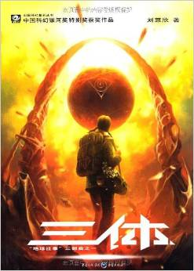
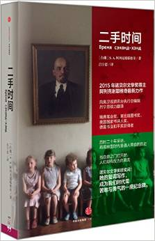
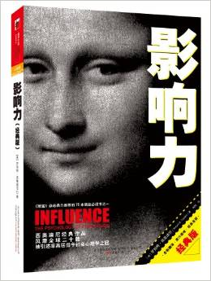
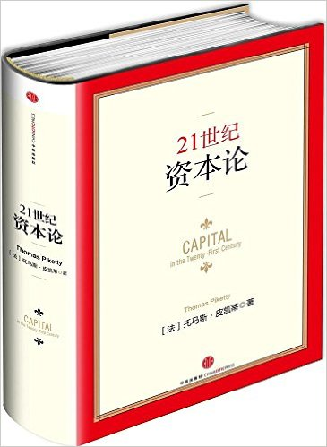
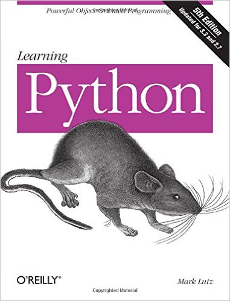
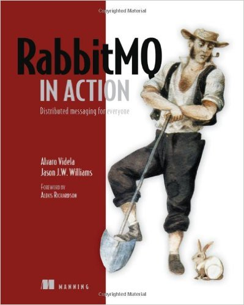
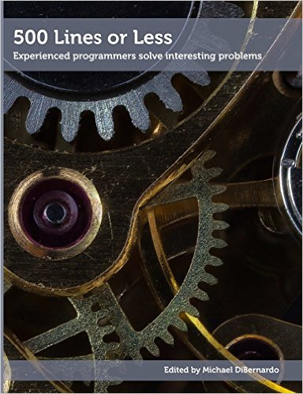

# Q3

## Literature & Social Science
1. **《三体: (第一部 地球往事)》** (***The Three-Body Problem (Remembrance of Earth's Past)***), 5.0/5.0

  > 刘欣慈

  > 2008, 1, 1st edition

  

  过去的几年断断续续有朋友推荐《三体》，尤其是在其2015年获得号称科幻界的
  诺贝尔奖——雨果奖之后, 更是有有一大波人趋之若鹜。这是亚洲人第一次获此殊荣。
  一个很有意思的现象是，身边每个看过《三体》的人，都对其赞不绝口倾力推荐。
  在我的朋友圈里，此前还没有哪本著作获得过这样的交口称赞。

  然而终究留到现在才看，细思之，大概有两点原因。
  一是一直以来就对科幻作品不感兴趣，尤其是中国科幻，总（无来由地）觉得太low；
  二是素来很讨厌跟风，每当有作家因获得某个大奖而作品一时间大卖时，我
  都会避而远之，等到风头过了，没有人铺天盖地的刷屏了，才会考虑去读。

  《三体》颠覆了我对科幻，尤其是中国科幻的认识，其想象力让人惊叹。爱因斯坦说，
  想象力比知识更重要(***Imagination is more important than knowledge***)。
  在现代的快节奏生活里，大部分人每天疲于奔命，忘记思考，更不要说想象，
  那是奢侈的东西。刘欣慈的《三体》像一道闪电，划破了黑暗麻木的生活，
  让想象力和活力重新回到大脑。

  **五星推荐！**

1. **《二手时间》** 4.5/5.0

  > S.A.阿列克谢耶维奇 (Svetlana Alexandravna Alexievich) (作者), 吕宁思 (译者)

  > 2015, 1, 1st edition

  

  周末闲逛，在市区遇到一家装饰和氛围都相当不错的书店，在全上海都为买房陷入疯狂
  的背景下，竟然还有这么多人会来到书店，真心的看书选书，顿时觉得精神境界高下立判。
  恰巧，书店当天还有2015年诺贝尔文学奖得主的签售会，虽然书比网上贵了1/3
  （原价出售），而且不保证一定能签到，还是毅然决定买一本，支持一下实体书店。
  关于作者，之前我并没有听说过。但是看完这部书之后，觉得还是物有所值的。而且
  由于作者迟到（原因未知），我也并没有等到签名。

  回到这本书。内容是几十篇采访，以第一人称叙述的方式，讲述了苏联解体后的
  二十年间，几十个来自不同年龄、阶层、职业、信仰的人们适应这种剧烈政治动荡的
  艰辛历程。作者本人也亲身经历了这个时代。是了解俄罗斯民族的一本杰出著作。

## Science, Philosopy, Economics
1. **《影响力(经典版)》** (***Influence***: The Phychology of Persuasion), 4.5/5.0

  > Robert B. Cialdini

  > 2010,9, 1st Chinese edition

  

  风靡全球二十载，社会心理学经典之作。

1. **《21世纪资本论》** (***Capital***: in 21st Century), 4.5/5.0

  > Thomas Piketty

  > 2014, 9, 1st edition

  

  严格来说，21资本论是我正儿八经读过的第二本经济学著作（第一本是公共问题经济
  学）。这部书先以其名字吓跑一批人 —— 我们从小就被迫学习政治，学习马克思，学习资本论，
  觉得马克思主义毫无生趣，也解决不了任何现实问题；再以其新华大词典一样的
  外观和厚度吓跑第二批人；最后作为一本正经的经济学著作吓跑第三批人。所以能下决心
  购买并认真读完的，占所有听说过这本书的人，我觉得是一个极小的比例。我很庆幸我
  是其中之一。以下是一些个人观点和见解，不全面，不专业，不深入，只是认真，
  谈一谈自己的一点收获。

  用一句话来概括，本书通过对过去300年的历史经济数据的研究，揭示了全球财富收入
  不平等正在扩大这一现象及其原因，提出的解决办法是征收全球累进资本税 —— 但困难重重。

  **财富收入不平等正在扩大**

  对任何一个国家的人口按照收入排名，划分出top 1%, 5%, 20%, 50%, 100%。作者发现，
  收入水平越高的阶层，其每年的财富增速越高。例如，如果top 20%阶层每年的财富增加
  是10%，中产阶级（top %20~50%）可能就是6%，底层50%人口的增速可能只有4%。

  出现这种情况的原因是，越富有的阶层，其手里的资本越多，而中下层的主要收入来源是工资。
  长期来看，资本的平均收益率远大于劳动所得的增长，特别是在经济低增长的时期。
  一个例子是，如果（剔除通货膨胀之后）经济增长率保持在3%左右（这已经很高了，按
  30年一代人算，连续30年3%的增长异味着下一代的实际购买力增加了50%），那平均工资
  增速也会在3%这个水平，但是富人的资本收益，很可以很轻松的达到6%以上。并且越富有
  的阶层，其平均资本收益率越高。从宏观来看，经济低增长将是21世纪的主要特征。
  所以一句话：富人越富，穷人越穷。

  **解决办法：征收全球累进资本税**

  作者认为，可以解决这种收入不平等扩大的办法是全球累进资本税。这里有两个关键词：
  **全球**和**累进**，二者缺一不可。**累进税**的意思是，按收入水平划定税率，
  收入越高，税越重；**全球**是说，必须在世界范围内同时实施这种税制，
  否则适得其反。因为如果在单一国家
  或地域（例如欧盟，但其实也不可能）征收的话，资本和富人就会外逃到没有施行这种
  税制的国家，这也是为什么很多欧洲国家不敢对富人或企业征收重税的原因之一。

  这里还提到一个比较有意思的问题: **关于中国的富人**。
  由于中国是施行外汇管制的，所以非常富有的人，是不能仅凭个人意愿随时可以将自己
  的巨额财产转移到国外的，而必须经过国家审核（洗钱另算）。
  所以作者提出一个问题：**这些富有的中国人，他们的钱到底是不是自己的？**

  与很多经济学著作不同，本书并没有太多枯燥的数学模型，而是从历史和统计的角度研究财富
  分配。事实上，作者也颇不认同现今的主流经济学研究，认为大部分研究者都过于沉浸在
  纯理论研究，而对正在发生的事实视而不见。

  ---------

  《21世纪资本论》中法国经济学家托马斯•皮凯蒂对过去300年来
  欧美国家的财富收入做了详尽探究，证明近几十年来，不平等现象已经扩大，
  很快会变得更加严重。托马斯•皮凯蒂认为，
  **我们正在倒退回“承袭制资本主义”的年代。在这样的制度下，
  经济的制高点不仅由财富决定，还由继承的财富决定，因而出身要比后天的
  努力和才能更重要**。托马斯•皮凯蒂在《21世纪资本论》中指出，
  **最富有的那批人不是因为劳动创造了财富，只是因为他们本来就富有**。

## Technical
1. **《企业应用架构模式》** (***Patterns of Enterprise Application Architecture***)

  > Matin Fowler

  终于明白企业应用是个什么鬼了。

1. ***Learning Python***, 4.0/5.0

  

  Dig deeply into Python.

  This book is fairly thick - 1594 pages in total.

  Skip some sections or even chapters if you feel boring or not need them right
  now. Look back at them when really feel the need.

1. ***RabbitMQ In Action***, 4.0/5.0

  > Alvaro Videla, Jason Williams

  > 2012

  

  As indicated by the title, this book focuses on **practice**. Get your hands
  dirty and write your code!

1. ***500 Lines or Less***: Experienced Programmers Solve Interesting Problems, 5.0/5.0

  > Amy Brown, etc

  > 2016, 7, 28

  

  **A 5-star Book.**

  This is the same series as [*The Architecture of Opensource Applications*](http://aosabook.org/en/index.html).
  Written by some most experienced programmers in the industry, one chapter per person, and collected as a book.

  I give it 5-star reviewing after only read two chapters:

  **Continues Integration** chapter builds
  an entire Continuous Integration System in less than 500 lines. I spent less
  than 1 hour on the text and code, but that gave me much more understanding
  than the last 20 hours I ever spent in browsing other CI articles/books.

  **Object Model** chapter builds a Python-like object model and implements it.
  Although it only takes python object model as the reference, the explanations
  and insights are much more essential than most of the Python books.

  Also interesting parts:

   * **Immutable Binary Search Tree** (DBDB)

  In one sentence: talk is cheap, show me your code. A book with moderate-size
  demo written by top coders in the industry is well derserved reading, full heart.

  Chapters I'd like to re-read many times in this time:

  * A Continuous Integration SYstem
  * DBDB: Dog Bed Database
  * A Python interpreter Written in Python
  * A Simple Object Model
  * A Template Engine

  ----------

  > This book provides you with the chance to study how 26 experienced
  programmers think when they are building something new. The programs you
  will read about in this book were all written from scratch to solve difficult problems.
  A web server, a pedometer, a Python interpreter, a web-based spreadsheet,
  and many more applications are written, in 500 lines of code or less,
  and described by their creators so that you can learn from their insights and their mistakes.

---------------------------------------------------
  [Previous: 2016 Q2](2016_Q2.md)           [Next: 2016 Q4](2016_Q4.md)
