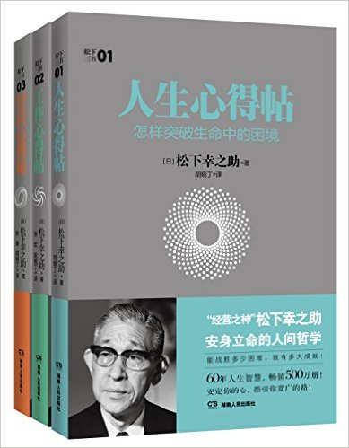
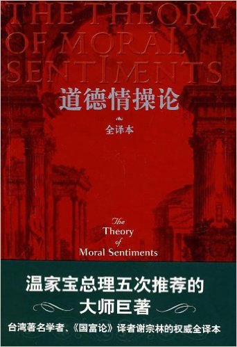
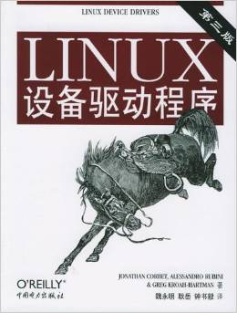

# Q4

## Literature
1. **《人生心得贴: 怎样突破命运中的困境》** 4.0/5.0

  > 松下幸之助

  > 湖南人民出版社; 第1版 (2015年6月1日) (成书时间：1960s~1990s)

  

  松下的书和星云大师的书有一个类似的地方，讲的都是大白话，谁都听过的道理。但与
  普通人讲出来不同，道理出自其之口，自有一种力量，让你顿时明白，噢，原来这个
  道理是这样的，原来还可以用在这里。

  另外一点，如果你觉得一本书有20%的内容对你有益，那已经不错了。不要指望100%。
  你还会重读好多次的，每次都有不一样的收获。

  贯穿全书的两个词：**坦诚、谦逊**。

1. **《工作心得贴: 发现和积累你的优势》** 4.0/5.0

  > 松下幸之助

  > 湖南人民出版社; 第1版 (2015年6月1日) (成书时间：1960s~1990s)

  宽广的视野和胸怀，国际胸怀

1. **《道德情操论》**

  > Adam Smith

  

## Science, Philosopy, Economics

## Technical
1. ***Linux Device Drivers***, 4.0/5.0

  

1. ***Docker Networking and Service Discovery***, 4.5/5.0

  A mini book.

1. ***Deploying OpenStack***, 4.0/5.0

  > Ken Pepple

  > 2011

  Another mini book.

1. ***Docker Networking and Service Discovery***, 4.5/5.0

  A mini book.

---------------------------------------------------
  [Previous: 2016 Q3](2016_Q3.md)
