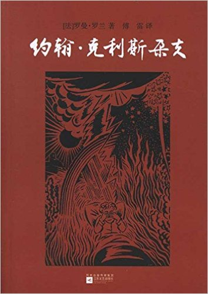
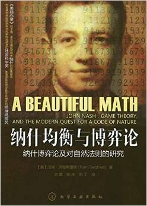
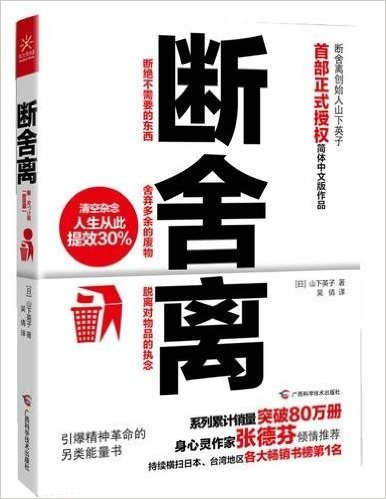
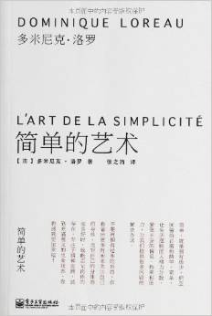

# Q4

## Literature
1. **《人生心得贴: 怎样突破命运中的困境》** 4.0/5.0

  > 松下幸之助

  > 湖南人民出版社; 第1版 (2015年6月1日) (成书时间：1960s~1990s)

  

  即将而立，百事颇惑，需哲学、宗教或者鸡汤突破精神困境，偶然发现了松下三书。
  从书名看去，似一个成功的长者回首往事艰辛，勉励后备，觉或有益，故入手之。

  读罢。

  松下的书和星云大师的有一个类似之处 - 讲的都是大白话，无甚文采，间或引用几句
  耳熟能详的谚语。如果是出自普通人之口，例如你周围的朋友，同事，同学，你获得
  的信息是零。但出自松下或星云大师之口，便自有一种力量，让你顿时明白，噢，
  原来这个听说了十几年的谚语并不是空话，原来这样浅显的道理是这样包含了无尽
  的人生智慧。究其不同，我觉得是包含说话者的人生阅历在里面。例如同样一本书，
  现在重读和十几岁第一次读的时候，感悟是完全不一样的。

  另外一点，如果你觉得一本书有20%的内容对你有益，那已经不错了。不要指望100%。
  如果你被书名或作者吸引过来，却发现无论如何都读不下去，那就放下，不是书写的不好，
  是你还没到需要读此类书的时候。

  贯穿本书的两个词：**坦诚、谦逊**。

1. **《工作心得贴: 发现和积累你的优势》** 4.0/5.0

  > 松下幸之助

  > 湖南人民出版社; 第1版 (2015年6月1日) (成书时间：1960s~1990s)

  宽广的视野和胸怀，国际胸怀

1. **《经营心得贴: 在不确定的世界坚实发展》** 4.0/5.0

  > 松下幸之助

  > 湖南人民出版社; 第1版 (2015年6月1日) (成书时间：1960s~1990s)

  ---

  后记：和人生导师偶然聊到执行力话题，他非常推荐稻盛和夫的几本书。稻盛和夫
  创立了三家世界五百强公司，在六七十岁高龄，用几个月时间将即将倒闭的日航扭亏为赢，
  并一路成为世界上最赚钱的航空公司。老师说稻盛和夫的哲学是那种
  道理极浅显但极少有人能真正领悟**并付诸实践**的类型。我说稻盛和夫的书我没
  看过，但是我最近刚看过松下三书，和你说的非常类似。老师说对的，稻盛和夫也
  非常推崇松下。然后，我回去就把稻盛和夫加入了心愿单。

1. **《道德情操论》**

  > Adam Smith

  

1. **《约翰克里斯朵夫》** (***Jean Christophe***), 4.5/5.0

  

  > 罗曼•罗兰 (Roltand.R.), 傅雷 译

  > early start of the 20th century

## Science, Philosopy, Economics
1. **《纳什均衡与博弈论》** (***A Beautiful Math***), 4.5/5.0

  ***A Beautiful Math***: John Nash, Game Thoery, and the Modern Quest for A
  Code of Nature.

  

  > Tom.Siegfried

  > 2006, 1st edition

  大部分人知道John Nash，大概是因为电影《美丽心灵》(***A Beautiful Mind***)。
  作为少数成功的、基于真实事迹改编的天才励志型电影，《美丽心灵》给纳什戴上了
  一顶无比荣耀的光环，让大家误以为纳什就是博弈论创立的。但事实上，
  纳什并不是现代博弈论的创立者。

  博弈论是20世纪初由天才数学家(**真的是天才**)冯诺依曼创立的。我们程序员一提到冯诺依曼
  首先想到的是计算机科学里的冯诺依曼架构，也即我们今天在使用的个人电脑的架构，
  都误以为冯是个专注于计算机科学的科学家和数学家。事实上此兄兴趣极其广泛，
  对物理、数学、计算机科学和经济学都做出了杰出的贡献，并在以上每个
  领域都作为具有突出贡献的科学家被后人瞻仰。

  作为智力超群的富二代，这位公子哥真的是不给别人留活路。
  这种开挂的人生和高斯有几分相似。
  据说高斯去世后留下了900多篇手稿，以现在的标准评判，每篇都是顶级paper。高斯给
  出了很多定理而没有证明，后世的数学家证明出其中一个即可以确立自己在数学史上
  的地位，而据传高斯不给出证明只是因为觉得证明过程太简单了。(果然是聪明的人
  都一样，我等愚笨的人各有个的愚笨)。

  说回正题。冯诺依曼确立的最初的博弈论，主要适用于两方零和博弈：简单说就是一方的
  获益（正）和另一方的损失（负）是相当的，二者的和为零，故称零和博弈。
  这其实已经非常牛逼，
  因为它第一次在数学上量化了博弈过程，并据此确立了一门崭新的学科，就像后来仙农
  量化了信息并确立了信息论一样。
  经济学家第一次可以用可量化的方法研究博弈过程。

  但是，世界是复杂的、多方的、（至少很多情况下是）非合作的。因此冯诺依曼的理论
  无法很好的用于研究真实世界面临的博弈问题，而更多的是用于推算一些较简单的理论模型。

  这时候，我们的主角纳什就华丽登场了。(**又是一个天才的故事**)。
  纳什申请普林斯顿（***MY DREAM UNIVERSITY***）的时候，教授给他写的推荐信
  只有一句话：“***此人是天才***”。（忽然觉得，不是天才就不要搞什么研究了。。。）。
  两年后，此话便得到了证实：1950年，纳什发表了一篇简短的只有两页的paper，题目
  是《多人博弈中的均衡点》，文章简要说明了多人博弈“解”的存在。这里的“存在”就是
  "纳什均衡"，而“解”就是纳什均衡点。

  纳什和冯诺依曼是有交集的，纳什在普林斯顿读书写paper那会，
  冯就在普林斯顿附近的研究所任职。纳什的paper还送给祖师爷冯诺依曼审过，
  但画风并非想象中美好：冯诺依曼对纳什的结果不以为然。

  那么，到底怎么理解纳什对博弈论的贡献呢？纳什均衡又是什么呢？这本书作了一个
  很好的类比。**在自然界中，每个事物都寻求稳态。岩石从山顶上滚下来是
  因为在山顶上岩石具有巨大的势能，滚下来释放了这种能力，在山谷达到了一个稳态**。
  纳什的突破点在于，他证明了**多方非合作博弈中稳态是一定存在的**（可能
  不止一个），称为**纳什均衡**，这些稳态点就是纳什均衡点。证明过程据说非常巧妙，
  ~~也不是太难~~ (“不是太难”这句话不是我说的)，有
  兴趣的可以研究研究。

  举个例子，在几个人玩牌时，每个人会根据对手的出牌情况不断
  调整自己的出牌策略使得自己收益更大。纳什均衡的意义在于它证明了，
  这几个人一直玩下去，一定会达到一个稳态，在这个状态下，每个人都确定了自己的
  最佳出牌策略并且不会再改变。因为在这个状态下，不论他如何调整策略，
  他的收益都将下降。这个状态(纳什均衡点)在数学上是可求解的。

  纳什均衡是弥补了博弈论基础中缺失的极其重要的一环，使得博弈论由理论走向了实践。
  推动了物理学、化学、生物学、进化论、经济学、医学、神经科学、天文学、社会学
  。。。等等
  （**看完这本书，我觉得差不多一切学科了**）学科的基础研究的发展。

  最后说到这本书，比较薄，160+页，属于科普和综述著作，作者是业内比较有资历的
  研究者兼记者、作家，采访过博弈论领域的很多顶级大拿，此书是不错的博弈论入门
  读物。

1. **《断舍离》**, 4.0/5.0

  

  > 山下英子

  > 2013

  **"这梦想依旧伟大/我已不再是什么代码英雄/我已成熟的像个老者/与生活完全讲和"**

  2016的下半年，我开始去做一些以前特别抵触、觉得特别不符合我性格的事情，
  比如在各种单位硬着头皮腆着脸皮地办手续、关心起经济和国家政策、
  极其认真地了解起城市规划、
  和别人探讨和分享室内设计风格和家具电器选购经验，思考如何布置自己的家等等。

  对于装修设计，要特别特别感谢Eric同学一个多月的全程科普, 尤其是对其大爱的MUJI风。
  在一个月的时间里，E同学对设计从无到有的积累让我觉得他都可以再顺便开个装修公司了。
  我也很喜欢MUJI。但看多了之后，觉得此风也在变得越来越大众。
  作为一个总想跟大众拉开一点差距的小众分子，我开始关注其他的风格。这时，极简主义
  （Minimalism）进入了我的视野。

  最初是偶然在知乎上读到的一篇文章：
  [《为什么你的生活一团糟》](https://zhuanlan.zhihu.com/p/23999232)，
  对其中乔布斯坐在
  地板上的一张照片象深刻。照片中，乔布斯房间东西很少，被很多人解读为极简主义，
  ，并将极简主义和节俭、简朴画上等号。作者就此说到，极简主义和简朴并不是一个概念，
  甚至在这张照片中，乔布斯房间里的每样东西都是很贵重的名牌。
  这是我第一次开始认真研究起极简主义。于是
  想读几本关于这一主题的书，《断舍离》是其中的第一本。

  这本书很薄，只有150页左右。大概3个小时就可以看完。作者经常面向大众开展断舍离
  的讲座，所以内容以实践为主，介绍如何在生活中实践断舍离来改善自己的生活质量。
  没有很高深的理论，推荐快速一读。

1. **《简单的艺术》** (The Art of Living A Simple Life), 3.8/5.0

  

  > Dominique Loreau

  > 2011 中文版

  近期所看的第二本关于极简主义的书。作者有点特殊，是法国人，在日本旅居多年，
  研究和实践东方的简约哲学。

  两本书过后，极简主义其实和我最初想象的并不相同。我想象中的极简主义著作，或者
  更准确地说是我想看的一类著作，是偏向设计的极简主义，比如教人如何选择生活用品，
  如何对家居进行布局，如果提升生活品味等等, 我把极简主义想成了和MUJI一样的一种
  家居风格 (因为网上看到过一些此类设计）。而这两本书所重点着墨的，其实都是
  如何发觉生活中的必需品和非必须品，如何慢慢说服自己把不不要的东西统统扔掉，
  以减少干扰，最终达到一种心灵的宁静和自我与居住环境的统一与和谐的精神境界。

  书中认为，现在形形色色林林总总的物质诱惑太多，大部分我们买回家的东西其实都
  很少或从来没有被用到，比如超市大减价时囤积的商品，或者服装折扣是买的衣服，
  或者旅行带回来的各种纪念品，扔到一个角落再也没有了用途。家里任何的一样的东西，
  都会分散我们的一些注意力和时间，而我们并未从这种精力和时间上获得任何益处，
  反而还可能徒生烦恼：扔了觉得可惜，留着又占地方又毫无用处。
  极简主义或者断舍离的很大篇幅，就是在教你怎样客服这种心理，并且如何付诸行动，
  以及展示这种生活方式带来的实实在在的好处。我觉得这种生活哲学颇有道理，并且
  某些方面来讲，我本身就有这种倾向，但是这本书里的做法，我不是完全赞同。
  如果完全按照作者的力推的生活方式去生活，感觉就要放弃任何为兴趣爱好所做的收藏了。

  从这本书开始，我决定放弃0.5分一个间隔的打分方法, 改为0.1分的间隔。
  因为这本书在我的评价里不够4.0分，但又比3.5分高。

  书很薄，200页，大部分地方都可以快速翻翻，几个小时就看完了。

## Technical
1. ***Linux Device Drivers***, 4.0/5.0

  

1. ***Docker Networking and Service Discovery***, 4.5/5.0

  A mini book.

1. ***Deploying OpenStack***, 4.0/5.0

  > Ken Pepple

  > 2011

  Another mini book.

---------------------------------------------------
  [Previous: 2016 Q3](2016_Q3.md)
