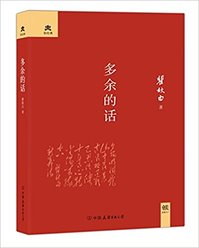
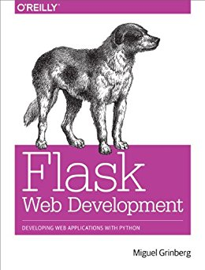

# Q1

## Literature & Social Science

1. **《罪与罚》** (***Crime and Punishment***) 4.5/5.0

    > 陀思妥耶夫斯基 (Fyodor Dostoyevsky)

    > First Published: 1866

    > This Edition: 2013, 中国友谊出版公司

    <p align="center"></p>

    陀思妥耶夫斯基(1821-1881)，19世纪俄国大作家，与列夫托尔斯泰、屠格涅夫齐名，
    代表作《罪与罚》，这些属于中学语文必背常识，那会不免抱怨怎么起这么个拗口的名
    字，万一真考到了，写错一个字分可就全没了。其实回头看，中学要记要背的东西（不
    仅限语文）都太干了（干货的干），如果遇到一个博学风趣的老师，能够在一本正经传
    道解惑的同时顺便讲点八卦，那同学们的兴致肯定立马来了。

    比如今天说到《罪与罚》，我们先来聊点陀老爷子的八卦。陀少出生于一个医生家庭，
    早在中学时代，就熟读大量国内外文学名著，包括普希金的，果戈里的，巴尔扎克的，
    雨果的，席勒的等等这些你们也许还知道的大作家，以及其他更多也很厉害但你们才疏
    学浅(我更是)所以不知道的大作家，我就不一一列举了。25岁时，陀少写了一部小说《
    穷人》，自此一举成名。但是，不要以为陀少是那种温文儒雅地待在书房写点岁月静好
    的作品的一类作家，如果是那样，我也就不会在这里码字给你们看了（ubuntu + vim +
    linux下不好用的中文输入法）。

    19世纪中叶——如果你还记得中学学的世界历史的话——是俄国历史上比较黑暗的时期，也
    是新旧思潮交替的时期，有点类似于我国晚清。所谓时势造英雄，大风起兮云飞扬，我
    们的陀少怀揣报国梦参加了俄国最早的进步知识分子革命组织，但不幸于1849年被捕，
    并被判处死刑。幸运的是，临刑前几分钟被沙皇赦免，改为流放服苦役（4+5年）。想
    象一下刑场上刽子手已经噗的一口老酒喷到刀上，举刀眼看就要朝陀少脖子上砍下去了
    ，突然人群后一人快马加鞭高喊：圣旨到，刀下留人！这种桥段在现今二三流的拙劣古
    装剧里已然被玩坏，但是历史上真实的案例恐怕极少，而有这种经历的大作家更是极少
    。《罪与罚》即是陀老爷流放回来之后的巅峰之作，其中一些情节很有自己年轻时的影
    子。

    《罪与罚》的故事情节其实很简单：**年轻的大学生因为贫穷和自觉社会不公，杀死了
    一位阴冷的放高利贷的老太婆和她妹妹，最终到派出所自首**。至于为什么这么简单的
    故事能写出600页（中文翻译），感兴趣的可以去百度或万方找一些academic paper读
    读，其涉及了历史学(需要对沙俄时期的历史有一定了解)，社会学，心理学（犯罪心理
    学，佛洛依德等），哲学和宗教（东正教）等等, **庞杂而深奥，我真的讲不清**。不
    过我觉得自始至终贯穿小说的核心问题很有意思：**是否存在两类人，平凡的人和非凡
    的人，其中非凡的人可以不受法律和道德约束，比如可以杀人**。如果让你支持这个论
    点(这也正是小说主人公一直秉持的信念)，你能想到哪些论据？

    再来看看这个版本的封皮上的评价：“一部深刻的现实主义作品，一部剖析罪犯内心世
    界的卓越的社会心理小说，一部震撼灵魂的巨著”，以及“**托尔斯泰代表了俄罗斯文学
    的广度，陀思妥耶夫斯基代表了俄罗斯文学的深度**”，以及最后对陀爷的评价：“**与
    巴尔扎克、狄更斯一起被誉为‘欧洲小说艺术不可攀的大师’**”。

    好了，有了以上八卦，你是否觉得背诵陀爷全名及代表作简单了很多, 甚至有了阅读整
    本书的冲动？

    最后打个预防针：这本书的成就重在心理学、哲学、宗教上，不在文采和情节，甚至很
    多章节读起来相当乏味，一个人讲起话来能连续唠叨个几页连段落都不分。我觉得第一
    遍读很适合采用80/20法则：觉得乏味的地方快速翻过，感兴趣和核心论述的地方仔细
    读读。

    **向牛逼的人生致敬！**

    **水滴悦读，NO.3**

1. **《偷影子的人》**  (***Le voleur d'ombres***) 4.8/5.0

    > 马克•李维 (Marc Levy) (作者), 段韵灵 (译者)

    > 湖南文艺出版社; 第1版 (2012年7月1日)

    <p align="center"></p>

    《偷影子的人》是去年热销榜上的书，凑单的时候买了一本，直到最近才翻出来。
    再次感叹一句，纸质书就是有这点好，你买了，就终究会有一个时候拿来读
    。不像电子书，放到一个文件夹，就再也想不起来了。

    关于这本书，之前并没有听说过作者，推荐上面写着，“全世界拥有最多读者的法国作家”
    —— 对于此类措辞，我一般不以为意，都当商家为了销量而乱写的，反正吹牛不负法律责
    任。但看到后面几组数字，始觉作者好像确实有点厉害：“作品热销45国，总销量超过
    2600,0000册”；再后面看到“**连续12年蝉联法国最畅销作家，让斯皮尔伯格只看两页书
    稿，就重金购下版权**”，顿觉前面这应该的确是个大拿。但是话说回来，作品畅销是一
    回事，其风格对一个具体读者来说喜不喜欢，是另一回事。

    终于当我读完之后，我回来说，这是一个我喜欢的作家，这是一本我极其喜欢的作品, 特
    别是其气质。这本书使我想起了几年前读过的另一本小说,一个意大利物理博士写的，《
    质数的孤独》。它们弥漫有相同的气质：**孤独** - 但又与《百年孤独》的那种孤独不
    同，是年轻的、柔软的、忧伤的孤独，而不是沧桑的、厚重的、民族的孤独。

    这本小说是作者的第10部作品，我很有兴趣再读读这位大拿的前面9部作品。

1. **《小王子》**  (***The Little Prince***) 4.5/5.0

    > Antoine de Saint-Exupéry, 马爱农 (译)

    > First Published: 1943

    > 万卷出版公司; 第1版 (2016年7月1日)

    <p align="center"></p>

    **Biography**

    安托万·德·圣埃克苏佩里 (1900—1944)，法国作家、飞行员。著有《小王子》《风、沙
    与星辰》等。1944年7月31日执行侦察任务时失踪。

    ANTOINE DE SAINT-EXUPÉRY, the "Winged Poet," was born in Lyon, France, in
    1900. A pilot at twenty-six, he was a pioneer of commercial aviation and flew
    in the **Spanish Civil War and World War II**. In 1944, while flying a
    reconnaissance mission for his French air squadron, he **disappeared** over
    the Mediterranean.

    The Little Prince was first published in 1943, only a year before the author's
    **Lockheed P-38** vanished over the Mediterranean during a reconnaissance
    mission. More than a half century later, **this fable of love and loneliness**
    has lost none of its power.

    ----

    The first I heard ***The Little Prince*** was when I was in high school, from
    a classmate who had distinguishd background and ways of thinking and behavings
    . A decade has already gone by since then, during which I've seen
    ***Little Princess*** being mentioned many times in many different places, and
    finally I read the it today.

    The Little Princes is a short story, and the target readers are children. I
    spent 2 hours reading through the Chinease version, and 3~4 hours the English
    one.

    It tells a 10-day story between a pilot and a little boy - the little prince -
    who came from another planet. A pilot landed in the Sahara Desert - a thousand
    miles from any inhabited region - as his plane somehow brokened. While he was
    repairing the plane, a little boy appeared, who asked him to draw a sheep.
    "**In the face of an overpowering mystery, you don't dare disobey**," the
    pilot recalled. And so begins their dialogue, which stretches the narrator's
    imagination in all sorts of surprising, childlike directions.

    The little prince repeats many times the following words:

    > And now here is my secret, a very simple secret: It is only with the heart
    that one can see rightly; what is essential is invisible to the eye.

    Just like the author wrote in the end of this book, this is the "loveliest and
    saddest landscape in the world". Little princess lived on a (really really)
    small planet - and he is the only one lived there. He likes to watch sunsets,
    he used to watch 44 times of sunsets during one day.

    The book permeates a strong feeling of love and loneliness and sadness.
    Sentimental and beautiful.

    In the real life, the author disappeared when he was driving a plane, was he
    flied to Little Prince's planet to meet his little lonely friend?

    **To when we were young!**

1. **《多余的话》**  (***The Superfluous Words***, by Qiubai Qu), 4.5/5.0

    > 瞿秋白

    > Written: 1935

    > This Edition: 中国友谊出版公司; 第2版 (2014年10月1日)

    <p align="center"></p>

## Science & Technology, Philosopy

1. **《道德情操论》** (***The Theory of Moral Sentiments***) 5.0/5.0, (translation 4.9/5.0)

    > 亚当·斯密 (Adam Smith) (作者), 谢宗林 (译者)

    > First Published: 1759

    > This Edition: 中央编译出版社; 第1版 (2008年8月1日)

    <p align="center"></p>

    **这又是一本难以描述的书。**读这部初以为是文学其实是哲学的著作，
    像极了那句“一脸懵逼的进来，一脸懵逼的出去”。从中得到的深刻教训是以后再也不能仅凭
    书名好玩来选书了。

    这本书之枯燥导致我第一次只读了1/8就放弃了，缓了半年之后重新投入
    战斗，终以极大的耐力将其拿下。然而，除了寻章摘句之外，我不知道该给大家分享点什
    么。于是在动笔之前，前先去网上搜了一下, 发现对这本书的评价竟然两极分化：有的认
    为是奇书，甚至认为亚当斯密的这本《道德情操论》比其稍后的另一部著作同时也是其代
    表作《国富论》更有价值；另有一少部分人，觉得此书没有什么了不起的地方，之所以近
    年来如此出名受关注，完全是因为前总理温家宝在不同场合的五次推荐。更有一部分颇为
    不理性的群众，觉得这本书的价值反而因为是总理推荐，而大打折扣。

    的确，和《国富论》相比，《道德情操论》的名气要小的多。但在亚当斯密自己看来，
    《道德情操论》(1759年第一版)的重要性是《国富论》(1776第一版，也是美国建国那年)无法比拟的：

    > Smith continued making extensive revisions to the book (The Theory of Moral
    Sentiments), up until his death.  Although The Wealth of Nations is widely
    regarded as Smith's most influential work, it is believed that Smith himself
    considered The Theory of Moral Sentiments to be a superior work.[1]

    亚当斯密(1723.6.5—
    1790.7.17)在当时是著名的哲学家，在其生命的最后30年里，他更新了5版《道德情操论
    》(直到去世)，而只更新过1版《国富论》。只是后来的历史发展方向使他
    以经济学家的身份出了名并被后世铭记。

    亚当斯密在《道德情操论》中想要解决的问题是，
    **对于一个刚来到这个世界的、没有任何道德情操（简单但不太准确地，可以把“道德情操”
    理解为关于"道德的感觉"）的人，是如何在之后逐渐形成这种情操（感觉）的，这种能力的
    源头是什么**。为此他提出了一种**基于同情的理论**(a theory of sympathy)，依这种
    理论，**通过观察他人，以及观察他人对于他们自己以及他人的评价**，使得人们意识到
    自己，并意识到别人如何感知（评价）自己的行为。(His goal in writing the work
    was to explain the source of mankind's ability to form moral judgement, given
    that people begin life with no moral sentiments at all. Smith proposes a
    theory of sympathy, in which the act of observing others and seeing the
    judgements they form of both others and oneself makes people aware of
    themselves and how others perceive their behavior. [1])

    所以，关于《道德情操论》的讨论其实都是哲学范畴，这些讨论都发声在各种
    哲学期刊和会议上。吾辈道行太浅，远未入哲学之门，故只能谈点最最基本的个人感受。

    在读到这本书之前，我从没想到过会有人去研究这些看起来"毫无用处"的问题:论行
    为的合宜感，论各种感情合宜的程度，论处境的顺逆对人类评论行为合宜与否的影响，论
    功劳与过失，即论奖赏与惩罚的对象，论我们品评自己情感与行为的基础，并论义务感，
    论效用对赞许感的影响，等等。要理解为什么要研究这些，需要一点历史背景。《道德情
    操论》第一版成书于1759年，在此之前，1687年，牛顿发表了划时代的著作《自然哲学的
    数学原理》，以几个极其简单优美的定理（公式）统一了自然科学，只要给定了宇宙的初
    始状态（第一推动），剩下的万物运动都可以用牛顿三大定律来精密解释和预测；亚当斯
    密想做的尝试是，在哲学领域有没有类似的基础定理，可以推导和解释全部的社会行为（
    其中重要的是，情感和道德行为），《道德情操论》即是对这一问题的探索。

    内容的话，刚开始趁着一股新鲜感还能一口气看十来页，但用不了多久就会觉得相当乏味
    ，不知所云，难以卒读。对于每一节，我都是先屏气凝神的盯着标题（很多标题特别长）
    思考几秒十几秒钟，然后潜心研读正文，一节读完，再往前翻几页重新去看看刚才的标题
    ，因为一节读完已经不记得它讲的是什么主题了。拎两个例子出来，你们感受一下, 以下
    都是小节标题：

    > （第二章）第三节 如果施惠者的行为未获赞许，则受惠者的感激便很少会有人同情；
    相反，如果加害者的动机未受谴责，则受害者的怨恨便不会有人同情

    > （第四章）第二节 论合用的外表赋予人的性格与行为的美，并论这种美在何种程度内
    可以被视为赞许该性格或行为的一个根本要素

    但是，已极其坚忍的毅力读完后，还是有一些收获。

    首先说书名和内容，从原著书名the theory of moral sentiments来看，这本书讨论的是
    ***Sentiments***，中文译作了**情操**, “moral”只是情操的修饰语。这样的中译本书
    名，可能会让人觉得“道德情操论”的翻译有点欠妥，因为从中文的表达来看，似乎“道德”
    和“情操”处在平级的位置，好像作者要讨论的是两个主题：“道德”和“情操”。亚当斯密的
    这本书在30年间更新了6版，对于前面的几版，确实主要是在讨论“情操”，但是到了他去
    世前的最后一版，也即第6版，他已经将很多“道德哲学”相关的问题从原来散布在各章节
    之中，单独整理出来，放到第七章，总共占了将近全书的1/4篇幅，我们看到的这个译本
    是以原著第6版为基础的，所以从这个角度说，“道德情操论”这个中文翻译其实也没问题
    。另外说到翻译需要提一句，这本书有好几个中译本，这个版本是台译本，译者同时也是
    《国富论》的译者，学识渊博，文采斐然；其他几种大陆的译本，网上评论说很差，不仅
    错误很多，而且随意删减原著的篇幅。建议选择慎重。

    我个人觉得这个译本很不错，台湾人做事整体来说还是比国内要靠谱，不像国内那么浮躁
    和功利化。另外这个译本真的是文采飞扬，个人觉得略微不足的是，由于原著都是英语长
    句（大量的定语前置后置什么的），语法在英语里比较自然，但是在地道的中文里，我们
    没有这种写法。这个译本的一个特点就是保留了这种语法，用中文翻译出来，原著是一个
    长句，翻译成中文也是定语满天飞的一个长句。所造成的后果就是句子超长，修饰语超多
    ，读起来超累。再加上本来就是讨论的极其抽象的内容，所以没有点定力的话，看一会就
    想放弃了。

    本书论述上的另一个特点是，先抛出一段抽象的，由长句组成的充满修饰语的论述，让人
    看的一脸茫然，就是那种看到后半句时已经忘了前半句说的是什么的感觉。比如下面这段
    ：

    > 这种自然的情感包容与同化倾向，亦即我们这种自然的倾向于尽可能使我们自己的意见
    、原则和感情，和我们在我们必须经常与其共处交往的那些人身上看到的那些根深蒂固的
    意见、原则与感情，尽量相容乃至相同，是导致“近朱者赤近墨者黑”这种效应的原因。

    有没有懵逼？没关系，接下来举一两个例子：

    > 一个经常和一些有智慧与美德的人交往的人，即使他本人没有变成有智慧有美德的人，
    至少也会禁不住对智慧与美德怀有一定的敬意；一个经常和一些浪荡堕落的人交往的人，
    即使他本人并没有变得浪荡堕落，至少也必定会很快的失去他对浪荡堕落的行为原先感觉
    到的一切厌恶。

    看到这两个例子，再回过头去读一读前面那段，是不是恍然大悟，觉得这段抽象论述的太
    好了？

    有人说，《道德情操论》是《国富论》的基础，要更深刻的理解《国富论》，更深刻的理
    解亚当斯密的思想，就必须要读一读《道德情操论》。

    我无法描述我从这本书中具体收获了什么，但是有句话说的好，但行好事，莫问前程。

    **水滴悦读，NO.4**

    -----

    References:

    1. [Wikipedia: Adam Smith](https://en.wikipedia.org/wiki/Adam_Smith)

1. **《旧制度与大革命》** (***Lancien Regime Et La Revolution***), 4.5/5.0

    > 亚历西斯•德•托克维尔 (Alexis De Tocqueville),  陈玮 (译者)

    > First Published: 1856

    > This Edition: 中央编译出版社; 第1版 (2013年4月1日)

    <p align="center"></p>

    > 在(2012) 11月30日的会议上，王岐山对与会专家学者说：“我们现在很多的学者看的是
    后资本主义时期的书，应该看一下前期的东西，希望大家看一下《旧制度与大革命》。”
    [1].

    这本书是探讨**导致法国革命的原因**，而不是一部关于法国大革命的记述。

    法国大革命(**1789－1799**)是一段激进与动荡的历
    史时期，对法国及全欧洲都留下广泛而深刻的影响。法国政治体制在大革命期间发生巨大转
    变：统治法国多个世纪的绝对君主制在三年内土崩瓦解，传统君主制的阶层观
    念、贵族以及天主教会统治制度被**自由、平等、博爱**等新原则推翻[3]。

    > The French Revolution was
    > a period of far-reaching social and political upheaval in France that lasted
    > from 1789 until 1799, and was partially carried forward by Napoleon during
    > the later expansion of the French Empire. The Revolution overthrew the
    > monarchy, established a republic, experienced violent periods of political
    > turmoil, and finally culminated in a dictatorship under Napoleon that
    > rapidly brought many of its principles to Western Europe and beyond.
    > Inspired by liberal and radical ideas, the Revolution profoundly altered the
    > course of modern history, triggering the global decline of absolute
    > monarchies while replacing them with republics and liberal democracies.[2]

    托克维尔出版此书
    的时间是1856年，距离法国大革命爆发（1789年）仅67年。他出身贵族，短短的一生就经
    历了五个朝代（法兰西第一帝国、波旁复辟王朝、七月王朝、法兰西第二共和国、法兰西
    第二帝国），他曾经是法国的外交部长，出于对政治的失望，后期就安心写作。

    历史教科书里总结革命爆发的原因，无外乎国王独裁专制，政府腐败，苛捐杂税，民不聊
    生等等通常所见的说辞。然而法国大革命似乎并不是这么回事。**路易十六统治时
    期是旧君主制最繁荣的时期，何以繁荣反而加速了大革命的到来？**

    托克维尔的判断是：**革命的发生并非因为人们的处境越来越坏**。经常的情况是，一向
    毫无怨言仿佛若无其事地忍受着最难以忍受的压迫的人民，一旦压迫减轻，他们就将它猛
    力抛弃。**流弊被消除，使得人们更容易觉察尚存的其它流弊；痛苦的确已经减轻，但是
    感觉却更加敏锐。此前人们对未来无所期望，现在人们对未来无所畏惧，一心朝着新事物
    奔去**。

    读这本书的一个意外小收获是，书中提及了我们经常在媒体上看到的“左倾”“右倾”是怎么
    来区分的。**平等与自由**是革命追求的两个目标，但是二者并不是毫无冲突的。追求绝
    对的平等，必然要牺牲一部分自由；而追求绝对的自由，必然导致不平等。由此产生关于
    “左倾”（过分追求平等）和右倾（过分追求自由）的最早划分。

    > “对一切旧体制的仇恨在增长。一向毫无怨言仿佛若无其事地忍受着最难以忍受的法律
    > 的人民，一旦法律的压力减轻，他们会将它猛烈的抛弃。经验告诉我们，对于一个坏政
    > 府来说，最危险的时刻通常就是它开始改革的时刻，国民明显地走向革命。”

    ----

    References:

    1. [凤凰卫视：王岐山为什么推荐《旧制度与大革命》 2012](http://news.ifeng.com/opinion/special/jiuzhiduyudageming/)
    1. [Wikipedia: Frence Revolution](https://en.wikipedia.org/wiki/French_Revolution)
    1. [Wikipedia: 法国大革命](https://zh.wikipedia.org/wiki/%E6%B3%95%E5%9B%BD%E5%A4%A7%E9%9D%A9%E5%91%BD)

1. **《菊与刀(70周年纪念版) 》**  (***The Chrysanthemum And The Sword***) 5.0/5.0

    > Ruth Benedict, 何晴 (译者)

    > First Published: 1946

    > This Edition: 浙江文艺出版社; 第1版 (2016年6月25日)

    <p align="center"></p>

    ```
    极度好战又极度温和
    极度黩武又极度爱美
    极度粗鲁傲慢又极度彬彬有礼
    极度死板又极度灵活
    极度恭顺又极度讨厌被使唤
    极度忠诚又极度反叛
    极度勇敢而又极度胆小
    极度保守又极度喜欢新事物

    The Japanese are, to the highest degree,both aggressive and unaggressive,
    both militaristic and aesthetic, both insolent and polite, rigid and
    adaptable, submissive and resentful of being pushed around, loyal and
    treacherous, brave and timid, conservative and hospitable to new ways.
    ```

    当年读研究生的时候，看到室友买了本书叫《菊与刀》，此前对这本书没有任何了解，
    也没有好奇去翻阅或打听一句是讲什么的，毫无根据却又无比确定地觉得，这肯定是一
    部日本小说。因为我的第一感觉，“菊”与“刀”都具有太明显的日本特色了。

    在我们中国的文学中，不论是传统诗词还是当代作品，“菊”和“刀”这两种意象其实都并
    非不常见。“菊”是文人墨客的挚爱，“刀”是武侠作品不可或缺的主题，但是，为什么现
    在一看到“菊”或“刀”字，尤其是两者同时出现，首先想到的却是日本呢？这至少说明，
    这两样东西已经深入到日本的民族特色之中，远大于他们在中国民族特色中的地位。在
    中国，他们只是众多的普通意象之一，必须在其上加上一些更有中国意象的修饰语，才
    能让人第一感觉就想到中国。例如，给“刀”加上修饰语，说“屠龙刀”，“雁翎刀”，“雪
    饮狂刀”，“青龙偃月刀”， “金丝大环刀”，马上就有了中国风既视感。

    因此，我觉得作为一部关于日本的著作，作者(一个美国人）极其敏锐地选择这两个意
    象作为标题，已经使本书成功了一半。准确地说，是一本（非常生动且深刻的）**剖析
    日本民族性和日本国民思考与做事方式的著作**，而不是我之前臆断的小说。并且，这
    部著作的产生还有**非常特殊的时代背景**：1944年美军与日军全面开战，他们发现日
    本人的思考和行为方式与西方完全不一样，因此迫切需要了解日本民族到底是怎样的，
    以帮组军队快速战胜日本，结束战斗。此书即为作者受美国政府之托所做的研究。本书
    最早是军方机密，1946年首次公开出版，直接影响了战后美国的对日政策，并被战后的
    日本高中引入教材。

    关于作者，也是有一些传（八）奇（卦）的，首先，她是女的，我们较少看到女科学家
    和研究者的著作，尤其是这么令人惊叹的著作；其次，她从小迷恋死亡，并专门研究和
    出版过著述；再次，她虽然结婚，却与另一位志同道合的女人类学家产生爱情。

    **关于中译本**

    因为这本书实在是太伟大太有名了，所以现在光中文译本据说就有20多个，这本译本是
    很新的，一个80后研究人类学的女在读博士译的，大概还不是很有名气。我没看过原著
    和其他译本，所以也无法比较，只能说读下来感觉翻译的还是非常流程，读的过程一直
    让我觉得这是一部极其令人惊叹的著作。唯一觉得不好的地方，是其中一段关于忠犬八
    公的，这个故事很有名，尤其是前些年又被翻拍电影，大家都已经习惯了那种狗译作“
    八公”（hachi，日语里"八"的意思，看电影里是因为那只狗被捡到的时候脖子上系着一
    个刻有八“的坠子），译者不知什么原因，这里音译成了哈奇，觉得很别扭，毫无必要
    。

    另外我觉得这个译本不错的一个地方是，**后记里列举了一些其他人类学家的观点和声
    音，在大家惊叹于这部伟大著作的同时，也不忘提醒一下，这部著作也有局限性**，尤
    其是考虑到作者当时限于时间和国际形势，并没有学习过日语，所有的研究都是基于
    小说、访谈、电影、日记等第二手资料。不过话说回来，基于二手资料都能剖析到这种
    深度，真的是太厉害了。

1. **《乌合之众:群体心理研究》**  (***Psychologie Des Foules***), 4.5/5.0

    > 居斯塔夫·勒庞 (Gustave Le Bon) (作者), 胡小跃 (译者)

    > First Published:

    > This Edition: 出版社: 浙江文艺出版社; 第1版 (2015年6月1日)

    <p align="center"></p>

## Technical

1. ***JavaScript: The Definitive Guide*** (4.2/5.0, this translation edition 3.9/5.0)

    > David Flanagan, 淘宝前端团队 (译者)

    > 6th edition, 2011

    > This Edition: 机械工业出版社; 第1版 (2012年4月1日)

    > 1000+ pages

    <p align="center"></p>

    One step closer to full stack engineer!

    This is really thick book, so I hesitated many times
    before making my decision to start reading - I though a long period of
    time is needed to finish it. It turns out, however, 1/3 of it are appendix
    of language and API references.

    A quick glance of JavaScript makes me sure that front-end is not that
    difficult, it's much easy to get on than back-end developing. Before this,
    I always afraid of front-end developments.

    Of this book:

    * first 1/4 part: JavaScript language basics, could go over it fast
    if you'be been familir with one or two modern programming languages

    * 1/2: JavaScript server-side and client-side programming - this is what
    makes JavaScript powerful and attracting

    * the last 1/4: JavaScript API reference, which I think should
    not be included into a book nowadays - the most effiecient and comfortable
    way to look for an API is
    google and stackoverflow, and seldomly will developers resort to a paper
    appendix.

    The 300+ pages API appendix makes the book too thick, too heavy, too expensive, yet
    no much beneficial to readers and developers.

    Of this translation: not very good, contains many apparent
    mistakes, the translators and reviewers seem relactant to revise them.

1. ***Flask Web Development***, 4.0/5.0

    > Miguel Grinberg

    > 2014

    > 200+ pages

    <p align="center"></p>

    A practical book on Flask. It first introduces Flask and some key modules,
    then implements a micro-blog website. Although the code is not much,
    the key functionalities are all included.
    
    A good reference for building Flask applications.

---------------------------------
  [Next: 2017 Q2](2017_Q2.md)
