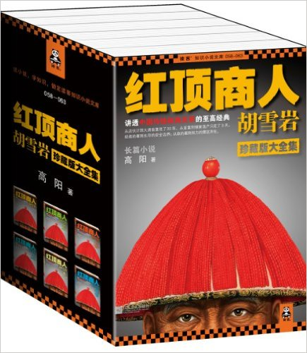
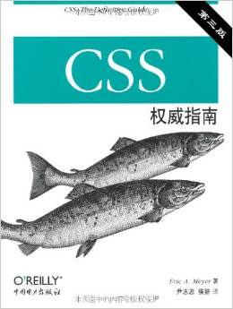

# Q1

## Literature & Social Science

1. **《红顶商人胡雪岩》**  5.0/5.0

  > 高阳

  > 江苏文艺出版社; 第1版 (2012年5月1日)

  

1. **《罪与罚》** (***Crime and Punishment***) 4.5/5.0

  > 陀思妥耶夫斯基 (Fyodor Dostoyevsky)

  > First Published: 1866

  > This Edition: 2013, 中国友谊出版公司

  

  陀思妥耶夫斯基(1821-1881)，19世纪俄国大作家，与列夫托尔斯泰、屠格涅夫齐名，代
  表作《罪与罚》，这些属于中学语文必背常识，那会不免抱怨怎么起这么个拗口的名
  字，万一真考到了，写错一个字分可就全没了。其实回头看，中学要记要背的东西（不仅限
  语文）都太干了（干货的干），如果遇到一个博学风趣的老师，能够在一本正经传道解惑
  的同时顺便讲点八卦，那同学们的兴致肯定立马来了。

  比如今天说到《罪与罚》，我们先来聊点陀老爷子的八卦。陀少出生于一个医生家庭，早
  在中学时代，就熟读大量国内外文学名著，包括普希金的，果戈里的，巴尔扎克的，雨果
  的，席勒的等等这些你们也许还知道的大作家，以及其他更多也很厉害但你们才疏学浅(
  我更是)所以不知道的大作家，我就不一一列举了。25岁时，陀少写了一部小说《穷人》
  ，自此一举成名。但是，不要以为陀少是那种温文儒雅地待在书房写点岁月静好的作品的
  一类作家，如果是那样，我也就不会在这里码字给你们看了（ubuntu + vim + linux下不
  好用的中文输入法）。

  19世纪中叶——如果你还记得中学学的世界历史的话——是俄国历史上比较黑暗的时期，也是
  新旧思潮交替的时期，有点类似于我国晚清。所谓时势造英雄，大风起兮云飞扬，我们的
  陀少怀揣报国梦参加了俄国最早的进步知识分子革命组织，但不幸于1849年被捕，并被判
  处死刑。幸运的是，临刑前几分钟被沙皇赦免，改为流放服苦役（4+5年）。想象一下刑
  场上刽
  子手已经噗的一口老酒喷到刀上，举刀眼看就要朝陀少脖子上砍下去了，突然人群后一人
  快马加鞭高喊：圣旨到，刀下留人！这种桥段在现今二三流的拙劣古装剧里已然被玩坏，
  但是历史上真实的案例恐怕极少，而有这种经历的大作家更是极少。《罪与罚》即是陀老
  爷流放回来之后的巅峰之作，其中一些情节很有自己年轻时的影子。

  《罪与罚》的故事情节其实很简单：**年轻的大学生因为贫穷和自觉社会不公，杀死了一
  位阴冷的放高利贷的老太婆和她妹妹，最终到派出所自首**。至于为什么这么简单的故事
  能写出600页（中文翻译），感兴趣的可以去百度或万方找一些academic paper读读，其
  涉及了历史学(需要对沙俄时期的历史有一定了解)，社会学，心理学（犯罪心理学，佛洛
  依德等），哲学和宗教（东正教）等等, **庞杂而深奥，我真的讲不清**。不过我觉得自
  始至终贯穿小说的核心问题很有意思：**是否存在两类人，平凡的人和非凡的人，其中非
  凡的人可以不受法律和道德约束，比如可以杀人**。如果让你支持这个论点(这也正是小
  说主人公一直秉持的信念)，你能想到哪些论据？

  再来看看这个版本的封皮上的评价：“一部深刻的现实主义作品，一部剖析罪犯内心世界
  的卓越的社会心理小说，一部震撼灵魂的巨著”，以及“**托尔斯泰代表了俄罗斯文学的广
  度，陀思妥耶夫斯基代表了俄罗斯文学的深度**”，以及最后对陀爷的评价：“**与巴尔扎
  克、狄更斯一起被誉为‘欧洲小说艺术不可攀的大师’**”。

  好了，有了以上八卦，你是否觉得背诵陀爷全名及代表作简单了很多, 甚至有了阅读整本
  书的冲动？

  最后打个预防针：这本书的成就重在心理学、哲学、宗教上，不在文采和情节，甚至很多
  章节读起来相当乏味，一个人讲起话来能连续唠叨个几页连段落都不分。我觉得第一遍读
  很适合采用80/20法则：觉得乏味的地方快速翻过，感兴趣和核心论述的地方仔细读读。

  **向牛逼的人生致敬！**

  **水滴悦读，NO.3**

## Science & Technology, Philosopy

1. **《道德情操论》** (***The Theory of Moral Sentiments***) 5.0/5.0, (translation 4.9/5.0)

  > 亚当·斯密 (Adam Smith) (作者), 谢宗林 (译者)

  > First Published: 1759

  > This Edition: 中央编译出版社; 第1版 (2008年8月1日)

  

  **这又是一本难以描述的书。**读这部初以为是文学其实是哲学的著作，
  像极了那句“一脸懵逼的进来，一脸懵逼的出去”。从中得到的深刻教训是以后再也不能仅凭
  书名好玩来选书了。

  这本书之枯燥导致我第一次只读了1/8就放弃了，缓了半年之后重新投入
  战斗，终以极大的耐力将其拿下。然而，除了寻章摘句之外，我不知道该给大家分享点什
  么。于是在动笔之前，前先去网上搜了一下, 发现对这本书的评价竟然两极分化：有的认
  为是奇书，甚至认为亚当斯密的这本《道德情操论》比其稍后的另一部著作同时也是其代
  表作《国富论》更有价值；另有一少部分人，觉得此书没有什么了不起的地方，之所以近
  年来如此出名受关注，完全是因为前总理温家宝在不同场合的五次推荐。更有一部分颇为
  不理性的群众，觉得这本书的价值反而因为是总理推荐，而大打折扣。

  的确，和《国富论》相比，《道德情操论》的名气要小的多。但在亚当斯密自己看来，
  《道德情操论》(1759年第一版)的重要性是《国富论》(1776第一版，也是美国建国那年)无法比拟的：

  > Smith continued making extensive revisions to the book (The Theory of Moral
  Sentiments), up until his death.  Although The Wealth of Nations is widely
  regarded as Smith's most influential work, it is believed that Smith himself
  considered The Theory of Moral Sentiments to be a superior work.[1]

  亚当斯密(1723.6.5—
  1790.7.17)在当时是著名的哲学家，在其生命的最后30年里，他更新了5版《道德情操论
  》(直到去世)，而只更新过1版《国富论》。只是后来的历史发展方向使他
  以经济学家的身份出了名并被后世铭记。

  亚当斯密在《道德情操论》中想要解决的问题是，
  **对于一个刚来到这个世界的、没有任何道德情操（简单但不太准确地，可以把“道德情操”
  理解为关于"道德的感觉"）的人，是如何在之后逐渐形成这种情操（感觉）的，这种能力的
  源头是什么**。为此他提出了一种**基于同情的理论**(a theory of sympathy)，依这种
  理论，**通过观察他人，以及观察他人对于他们自己以及他人的评价**，使得人们意识到
  自己，并意识到别人如何感知（评价）自己的行为。(His goal in writing the work
  was to explain the source of mankind's ability to form moral judgement, given
  that people begin life with no moral sentiments at all. Smith proposes a
  theory of sympathy, in which the act of observing others and seeing the
  judgements they form of both others and oneself makes people aware of
  themselves and how others perceive their behavior. [1])

  所以，关于《道德情操论》的讨论其实都是哲学范畴，这些讨论都发声在各种
  哲学期刊和会议上。吾辈道行太浅，远未入哲学之门，故只能谈点最最基本的个人感受。

  在读到这本书之前，我从没想到过会有人去研究这些看起来"毫无用处"的问题:论行
  为的合宜感，论各种感情合宜的程度，论处境的顺逆对人类评论行为合宜与否的影响，论
  功劳与过失，即论奖赏与惩罚的对象，论我们品评自己情感与行为的基础，并论义务感，
  论效用对赞许感的影响，等等。要理解为什么要研究这些，需要一点历史背景。《道德情
  操论》第一版成书于1759年，在此之前，1687年，牛顿发表了划时代的著作《自然哲学的
  数学原理》，以几个极其简单优美的定理（公式）统一了自然科学，只要给定了宇宙的初
  始状态（第一推动），剩下的万物运动都可以用牛顿三大定律来精密解释和预测；亚当斯
  密想做的尝试是，在哲学领域有没有类似的基础定理，可以推导和解释全部的社会行为（
  其中重要的是，情感和道德行为），《道德情操论》即是对这一问题的探索。

  内容的话，刚开始趁着一股新鲜感还能一口气看十来页，但用不了多久就会觉得相当乏味
  ，不知所云，难以卒读。对于每一节，我都是先屏气凝神的盯着标题（很多标题特别长）
  思考几秒十几秒钟，然后潜心研读正文，一节读完，再往前翻几页重新去看看刚才的标题
  ，因为一节读完已经不记得它讲的是什么主题了。拎两个例子出来，你们感受一下, 以下
  都是小节标题：

  > （第二章）第三节 如果施惠者的行为未获赞许，则受惠者的感激便很少会有人同情；
  相反，如果加害者的动机未受谴责，则受害者的怨恨便不会有人同情

  > （第四章）第二节 论合用的外表赋予人的性格与行为的美，并论这种美在何种程度内
  可以被视为赞许该性格或行为的一个根本要素

  但是，已极其坚忍的毅力读完后，还是有一些收获。

  首先说书名和内容，从原著书名the theory of moral sentiments来看，这本书讨论的是
  ***Sentiments***，中文译作了**情操**, “moral”只是情操的修饰语。这样的中译本书
  名，可能会让人觉得“道德情操论”的翻译有点欠妥，因为从中文的表达来看，似乎“道德”
  和“情操”处在平级的位置，好像作者要讨论的是两个主题：“道德”和“情操”。亚当斯密的
  这本书在30年间更新了6版，对于前面的几版，确实主要是在讨论“情操”，但是到了他去
  世前的最后一版，也即第6版，他已经将很多“道德哲学”相关的问题从原来散布在各章节
  之中，单独整理出来，放到第七章，总共占了将近全书的1/4篇幅，我们看到的这个译本
  是以原著第6版为基础的，所以从这个角度说，“道德情操论”这个中文翻译其实也没问题
  。另外说到翻译需要提一句，这本书有好几个中译本，这个版本是台译本，译者同时也是
  《国富论》的译者，学识渊博，文采斐然；其他几种大陆的译本，网上评论说很差，不仅
  错误很多，而且随意删减原著的篇幅。建议选择慎重。

  我个人觉得这个译本很不错，台湾人做事整体来说还是比国内要靠谱，不像国内那么浮躁
  和功利化。另外这个译本真的是文采飞扬，个人觉得略微不足的是，由于原著都是英语长
  句（大量的定语前置后置什么的），语法在英语里比较自然，但是在地道的中文里，我们
  没有这种写法。这个译本的一个特点就是保留了这种语法，用中文翻译出来，原著是一个
  长句，翻译成中文也是定语满天飞的一个长句。所造成的后果就是句子超长，修饰语超多
  ，读起来超累。再加上本来就是讨论的极其抽象的内容，所以没有点定力的话，看一会就
  想放弃了。

  本书论述上的另一个特点是，先抛出一段抽象的，由长句组成的充满修饰语的论述，让人
  看的一脸茫然，就是那种看到后半句时已经忘了前半句说的是什么的感觉。比如下面这段
  ：

  > 这种自然的情感包容与同化倾向，亦即我们这种自然的倾向于尽可能使我们自己的意见
  、原则和感情，和我们在我们必须经常与其共处交往的那些人身上看到的那些根深蒂固的
  意见、原则与感情，尽量相容乃至相同，是导致“近朱者赤近墨者黑”这种效应的原因。

  有没有懵逼？没关系，接下来举一两个例子：

  > 一个经常和一些有智慧与美德的人交往的人，即使他本人没有变成有智慧有美德的人，
  至少也会禁不住对智慧与美德怀有一定的敬意；一个经常和一些浪荡堕落的人交往的人，
  即使他本人并没有变得浪荡堕落，至少也必定会很快的失去他对浪荡堕落的行为原先感觉
  到的一切厌恶。

  看到这两个例子，再回过头去读一读前面那段，是不是恍然大悟，觉得这段抽象论述的太
  好了？

  有人说，《道德情操论》是《国富论》的基础，要更深刻的理解《国富论》，更深刻的理
  解亚当斯密的思想，就必须要读一读《道德情操论》。
  
  我无法描述我从这本书中具体收获了什么，但是有句话说的好，但行好事，莫问前程。

  **水滴悦读，NO.4**

  -----

  References:

  1. [Wikipedia: Adam Smith](https://en.wikipedia.org/wiki/Adam_Smith)

1. **《旧制度与大革命》** (***Lancien Regime Et La Pevolution***)

  > 亚历西斯•德•托克维尔 (Alexis De Tocqueville),  陈玮 (译者)

  > 中央编译出版社; 第1版 (2013年4月1日)

  

## Technical

1. ***CSS: The Definitive Guide***

  

---------------------------------
  [Next: 2017 Q2](2017_Q2.md)
