# Q2

## Literature & Social Science

1. **《文学回忆录》** 4.8/5.0

    > 木心讲述 （陈丹青笔记）

    > written: 1989-1994

    > this edition: 广西师范大学出版社; 第1版 (2013年1月1日)

    <p align="center">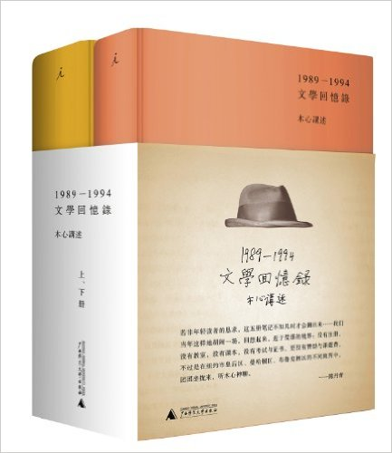</p>

    一

    木心是何时开始在大陆渐为人所知，我并不清楚。

    像我这样不怎么读书的人，知道木心这个名字，是因为某档选秀节目。
    一位选手将木心的一首小诗《从前慢》谱曲，唱了出来。自然——是特别好听。

    ```
   《从前慢》 木心

    记得早先少年时
    大家诚诚恳恳
    说一句 是一句

    清早上火车站
    长街黑暗无行人
    卖豆浆的小店冒着热气

    从前的日色变得慢
    车，马，邮件都慢
    一生只够爱一个人

    从前的锁也好看
    钥匙精美有样子
    你锁了 人家就懂了
    ```

    这
    首
    小诗给我一种很奇特的感觉，无缘由地觉得应该出自一个民国老作家之手，这种风格和
    心境，在1949年之后的大陆（文艺、政治和生活氛围里），应该没有人能写的出来。直
    到看到梁文道为本书作的序，才明白原来有这种感觉的并不是只有我一个：

    > 耐心的读者或许就会慢慢明白：木心为什么和“文坛主流”截然不同。。。。。。他“
    > 局外”到了一个什么程度呢？刚刚在大陆出版作品的时候，大家以为他是台湾作家，
    > 或者不知从哪儿来的海外作家；更早在台湾发表作品的时候，那边的圈子也在探听是
    > 不是一个民国老作家重新出土；他竟然“局外”到了一个没有人能从他的作品中读出来
    > 处的地步，“局外”到了让人时空错乱的地步。
    >
    > 梁文道《文学，局外人的回忆》

    这段话于我如觅知音，尤其那句“是不是一个民国老作家重新出土”，直击要害。

    ----

    二

    某次闲逛，看到知乎上一个帖子，[如何赏析木心的《借我》](https://www.zhihu.com/question/28536070):

    ```
    《借我》

    借我一个暮年，
    借我碎片，
    借我瞻前与顾后，
    借我执拗如少年。
    借我后天长成的先天，
    借我变如不曾改变。
    借我素淡的世故和明白的愚，
    借我可预知的脸。
    借我悲怆的磊落，
    借我温软的鲁莽和玩笑的庄严。
    借我最初与最终的不敢，
    借我不言而喻的不见。
    借我一场秋啊，可你说这已是冬天。
    ```

    也是小诗，篇幅短小，韵律别致，然而评论区里颇为激烈地争论起这首诗到底是不是木
    心的。

    有个人写了一篇颇长的赏析，试图证明这首诗肯定出自木心，末了说：“我每品读一次
    ，都读到沉重，读到压抑，读到苍凉，一个活着的木心先生便浮现与眼前。”

    这篇赏析
    在我读来颇为专业，比以前语文课上诗词鉴赏的标准答案写地还要好。

    但也有网友发话
    ：你就别矫情了，这首诗初读还可以，但文字完全经不起推敲，都是辞藻堆砌。**以木
    心的文学修养，他的每个用字都是找得到出处的**。这句话瞬间让我提起兴致，
    立即将大家提到的《文学回忆录》加入reading list。

    读完这本一千多页的课堂笔记，对木心先生的风格和修养有了一些了解，我觉得木心先
    生是担当得起 **“每个用字都是找得到出处”** 这句话的。再看这首《借我》，如果说是
    木心所作，那绝对是没有读过木心。那篇文字优美的赏析，现在也已在知乎也沦为笑柄。

    ----

    三

    《文学回忆录》由陈丹青听木心讲课的笔记整理而来。

    1989~1994，木心先生在纽约为一群中国艺术家讲述文学史，为期五年，留有完
    整讲义。讲义大致依据上世纪二十年代郑振铎编著的《文学大纲》。共83讲，时间上从
    文学起源(古代西方、东方神话)一直讲到二十世纪（当代意象主义、存在主义、魔幻现
    实主义等等）；横向上，涵盖了东西方各个主流文明，甚至波斯、爱尔兰、丹麦这些不
    以文学见长的小国文学都有讲到。

    名字的由来。木心在开课引言里说，**“我讲世界文学史，其实就是我的文学的回忆。”**

    **“讲完后，一部文学史，重要的是我的观点” —— 木心 开课引言**

    如果只是论述文学史实，这本《文学回忆录》并不足以从众多文学类书籍中脱颖而出。
    “木心的讲述，史实大幅简略，个人议论既多且广。（梁文道）”:

    > 他平视文学史上的巨擘大师，平视一切现在的与未来的读者，于是自在自由，娓娓道
    > 出他的文学的回忆。
    >
    > 梁文道《文学，局外人的回忆》

    我们极少能看到有人敢称苏格拉底为邻居大叔，敢与尼采、陶渊明称兄道弟，敢于公然
    批评或蔑视某位如雷贯耳的文学巨匠（TODO: need example/citation)，而其本人不是
    疯子。木心就是这样一位。

    > 我真想知道，有谁，这样地，评说文学家。我因此很想知道，其他国家，谁曾如此这
    > 般，讲过文学史——我多么盼望各国文学家都来听听木心如何说起他们。他们不知道，
    > 这个人，不断不断与他们对话、商量、发出诘问、处处辩难，又一再一再，赞美他们
    > ，以一个中国老人的狡黠而体恤，洞悉他们的隐衷，或者，说他们的坏话。真的，这
    > 本书，不是世界文学史，而是，那么多那么多文学家，渐次围拢，照亮了那个照亮他
    > 们的人。
    >
    > 陈丹青《文学回忆录 后记》

    木心先生晚年回到老家乌镇定居，于2011年去逝。

    向这样一位博古通今、学贯中西而又特立独行的“民国出土老人”致敬！

1. **《容忍与自由》** 4.4/5.0

    > 胡适 (1891-1962)

    > this edition: 武汉出版社; 第1版 (2015年9月1日)

    <p align="center">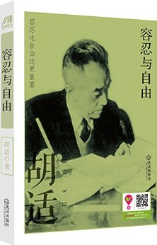</p>

    > 我活的越久，越觉得容忍比自由更重要。（胡适导师语）

    胡适是近代著名学者、文学家、哲学家、史学家、考古学家（还是政治家，做过中华民
    国驻美大使），一生有三十二个博士头衔。然而因为民主革命时期跟我党走的不近，有
    时候甚至唱反调，因而在新中国的教科书里遭受了不少非客观公正的评价。

    以前提起胡适，我们最先想起的可能不是他的《文学改良刍议》，不是他的“大胆假设
    ，小心求证”，不是他的白话文运动和文学革命，不是他对《红楼梦》、《西游记》的
    考证，而是历史课本里对他 **“多研究写问题，少谈些主义”** 的批判。

    要说资历，其实胡适跟我党的早期领袖陈独秀是好友，二人都是新文化运动的先驱。
    但与当时大多数人凌厉的姿势不同，胡适主张和平渐进的改革方式，因而与陈独秀等
    朋友渐行渐远，最后乃至于在报纸上互相批判。他熟悉西方民主制度，坚信“容忍比自由
    更加重要”，并在这条道路上孜孜以求。

    这本《容忍与自由》是胡适的一些杂文汇编，分为六卷：

    1. 论自由
    1. 论治学的方法
    1. 论社会文明
    1. 论人生观
    1. 论问题与主义
    1. 论人生观

    比较有名的几篇：《文学改良刍议》，《多研究些问题，少谈些“主义”》等等。

1. **《胡适谈哲学与人生》** 4.6/5.0

    > 胡适

    > this edition: 武汉出版社; 第1版 (2015年9月1日)

    <p align="center">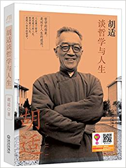</p>

    分上下两卷。上卷分两篇，分别论述 **中国古代哲学**和 **现当代西方哲学**，非常精彩。
    下卷是一些关于人生观的杂文集。

    胡适说，

    > 大凡一种学说，绝不是劈空从天上掉下来的。我们如果能仔细研究，定可
    寻出那种学说有许多前因，有许多后果。

    这句话充分体现了胡适讲哲学的特点：他讲到任何的流派，都会探究它出现的原因、背
    景、时间、地点，它想解决的问题，它与之前流派的关系，它又如何影响了以后的流派
    等等。以这样的方式讲述，哲学便不再是一门枯燥的、云里雾里的学科，而是一种形式
    抽象而又充满乐趣的思考，关于社会、关于人生、关于空间、时间和一切关乎人类的终
    极问题。

    中国古代哲学部分，从中国哲学起源（《诗经》）讲到老、孔、墨、庄、孟、荀，然后
    到程、朱，再到王阳明。脉络条理非常清楚。将许多我之前当文学读过的书串连了起来
    ，使我第一次建立了中国古代哲学体系的框架，以后再填坑就有方向多了。

    第二篇综述了西方哲学的发展，尤其是各个时期的哲学流派起源及其渊
    源，比如意象主义(Idealism)、实证主义(Positivism)、实验主义（Pgragmaticism）
    等等。胡适在美国留学期间师从实验主义（Pragmaticism）大师杜威，所以西方哲学基
    础也很深厚。

    水平和讲述方式可以轻易的让人喜欢和厌恶起一门学科，有多少学科乐趣都被当时平庸
    人和的教授方式毁了。胡适的书让我重拾这种乐趣。

1. **《胡适四十自述》** 4.6/5.0

    > 胡适

    > this edition: 武汉出版社; 第1版 (2015年9月1日)

    <p align="center">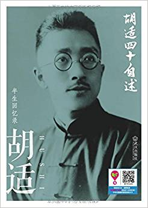</p>

    一代大师自述从记事开始到不惑之年的成长历程。让你看到胡适是如何成为的胡适的。
    包括身世、家教、际遇，很多我们熟悉的近代史穿插之中，通过胡适的讲述，这些
    零零散散的历史如珠子般被一根线穿到一起，受益匪浅。

1. **《人间失格》**, 4.8/5.0

    > 太宰治 (作者, 1909-1948), 曹捷平 (译者)

    > this edition: 中国友谊出版公司; 第1版 (2016年11月1日)

    <p align="center">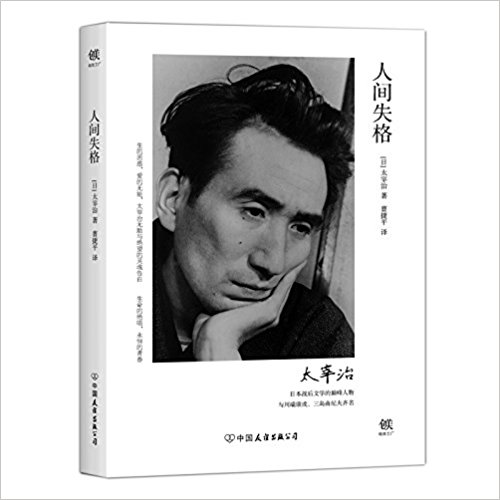</p>

    很有名的一本书，之前看过电影，虽然全忘了（看书过程中又一点点想起来了）。
    拆开之后才发现，这个译本很新，看履历好像不是什么大拿，不免为质量有点担心。
    联想到最近极端无耻无德的假《人类简史》事件，以后选书务必关注：

    * 出版社信息，出版年代
    * 译者信息
    * 亚马逊上的购书者的评论

    这本书除了《人间失格》之外，还包括一个短篇《维荣之妻》，一个中篇《斜阳》。

    我最喜欢《人间失格》，尤其是结尾，几句话仿佛过完一生：

    > 不过，一切都将过去。
    >
    > 我今年二十七岁。可因为头发花白，人们大都认为我已经四十多岁。

    《维荣之妻》有点莫名奇妙，感觉刚进入主题但突然就结束了。《斜阳》觉得不怎么样
    。

    ----

    **亚马逊书评**:

    太宰治巧妙地将自己的人生与思想，隐藏于主角叶藏的人生遭遇，借由叶藏的独白，窥
    探太宰治的内心世界——“充满了可耻的一生”。在发表该作品的同年，太宰治自杀身亡，
    为自己画下一个句号。

    ----

    作者简介

    太宰治（1909-1948），与川端康成、三岛由纪夫并列的日本战后文学巅峰人物，“私小
    说”领域的天才作家。出生于贵族家庭，从小心思纤细而敏感。晚期的《人间失格》，
    被誉为日本战后文学的金字塔之巅。他在不断自杀与自我否定中结束了自己的生命。

## Science & Technology, Philosopy

1. **《失控》** (***Out of Control***) 4.6/5.0 (this translation 4.4/5.0)

    > KK

    <p align="center">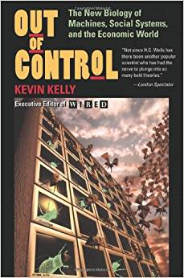</p>

    有一类人，其知识之博超出众人想象；有一种书，其夸学科论述内容之庞杂让人很难相
    信是出自一人之手。KK是这样一个人，《失控》是这样一部著作。

    《失控》是一部（至少在中国）非常有名的著作，且 K.K 因与国内互联网圈来往频繁
    ，在中国已经是事实上人工智能、未来科技的代名词之一，《失控》作为其代表作，也
    在科技类文章中屡被提及。以至于我一直以为它是一本畅想未来社会怎样因计算机技术
    而改变的著作。

    从中文版副标题“全人类的最终命运和结局”来看，确实很有新引力。但是通读之后，发
    现其实全书内容比较庞杂，有2/3的篇幅所讨论的并非是计算机技术，而是进化论、生
    态学、生物学、化学、物理学、社会学、经济学等等，剩下的1/3才是我们通常理解的
    技术（控制论、电子货币、人工智能等）。读完不免有个疑问：全人类的命运和结局在
    哪里？我怎么没看到关于这一主题的明确论述。直到看到原版的副标题：

    ***The New Biology of Machines, Social Systems, and the Econimic World***，

    才恍然明白是被自以为是的中文译本误导了。

    原书的副标题很好的对应了书中的三个部分：**Machines, Social Systems, Economic
    Wrold**,而中文版则完全弃之，自拟作 **“全人类的最终命运和结局”**，我想问一句
    小编，**KK自己都没好意思在书里说知道全人类的最终命运和结局，你们翻译成中文
    就知道了？**

## Technical

1. ***CSS: The Definitive Guide***

    <p align="center">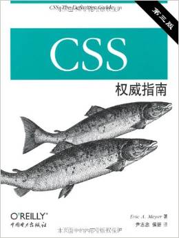</p>

1. ***Building Hypermedia APIs with HTML5 and Node***, 5.0/5.0

    > Mike Amundsen

    > 2011.11.22, 1st edition

    <p align="center">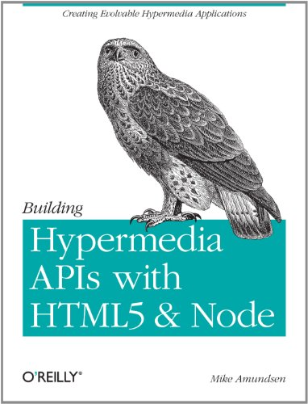</p>

    Different from most the O'Reily animal books, this one is really thin, only
    200+ pages. But this is one of the best animal books I've ever read.
    It discusses the principles to good hypermedia APIs design, and devotes
    three chapters to implementations, each based on different tools: XML, JSON,
    and HTML5.

    The intentional readers of this book are web application architects and
    engineers, with considerable expriences on this field. A book worth
    re-reading many times.

1. ***MySQL***: Developer's Library, 4.5/5.0

    > Paul DuBois

    > 4th edition, 2008

    <p align="center">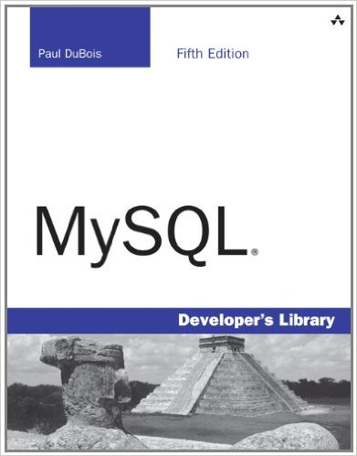</p>

    A good book on MySQL and general SQL database.

    MySQL provides a comprehensive guide to effectively using and administering
    the MySQL database management system (DBMS). It covers extensive MySQL
    tutorials, implementations, and administrations. A good book both for
    developers, and DB administrators.

    The author is from MySQL community - since the early days.

    I get to know the 5th edition was published in 2012 after I finished the
    4th edition. If you feel like to **learn some MySQL for great good**, go
    ahead for the newer one.

1. ***Compilers***: Principals Techniques and Tools, 5.0/5.0

    > Alfred V.Aho, Monica S.Lam, Ravi Sethi, Jeffrey D.Ullman

    > this edition: 机械工业出版社; 第1版 (2011年1月1日)

    <p align="center">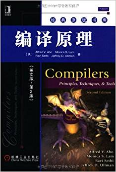</p>

1. **《程序员的自我修养：链接、装载与库》** (a Chinese book on *Linkers, Loaders and Libraries*) 5.0/5.0

    > 潘爱民 (作者), 俞甲子 (作者), 石凡 (作者)

    > this edition: 电子工业出版社; 第1版 (2009年5月1日)

    <p align="center">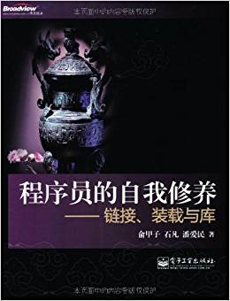</p>

    **电影《一代宗师》里说，习武之人有三重境界：见自己、见天地、见众生。**

    **本书之境界，已见天地。**

    出于许多原因，大部分程序员只将目光停留在所写的程序本身。而本书更深一层，关注
    的是程序从source code到running的过程；有了这一层的了解，再看之前写的程
    序，便有一种俯视视角，顿觉许多“其然”的根源——即“所以然”。

    我是一个对书名有所挑剔的人，如果觉得一本书的名字很烂俗，是不会去看它的。《程序
    员修炼之道》属于此类，《程序员的自我修养》也属于此类，所以从第一次听说本书到
    现在，至少5年过去了。5年中从多方渠道看到的对本书极高的评价，终促使我作出一
    些精神上的妥协——凑单的时候买了一本。

    大部分国人写的技术书——包括学校的一大部
    分指定教材——只能给3分，不能再多了。这些写书的人既无高深水平，又无编书的耐心
    与态度，只是为赚钱或绩效考评而东拼西凑。再迫于出版社的压力，为了控制成本，更
    是压缩的不成样子。读这样的书会觉得特别沮丧，因为很多内容看不懂。直到一个
    睿智幽默爱讲大实话的老师告诉我们，
    你们看不懂并不是能力不够，是书写的太烂，准确的说，这些教材不应该著名“xxx著”
    ，而应该是“xxx抄”。我还得再补个刀，是“xxx瞎抄”。

    但是，这本关于链接、装载与库的著作却是个例外。这是迄今为止我读到过的最好的一本国
    产技术书，过程中犹豫是该打4.5，4.6还是4.8，最后想到我的打分原则：**人无完人
    ，书无完书，只要觉得足够好，就给满分**。所以，在我的评分标准里，第一本
    国产满分技术书诞生了。

    关于书名，我觉得“程序员的自我修养”并不是太合适，它适合作为
    一个系列的名字，而不是一本书。和本书内容最贴切的应该是它的副标题“链接、装载
    和库”。本书的几位作者都是实战派而非理论派，所以一言不合就
    coding和hacking，这是技术人员最直截了当的方式，也是程序员理解技术原理的最有
    效方式。

    通过这本书你至少可以学到：一个（从最简单的hello world到真实环境的复
    杂程序）从编译（从略）、（与静态或动态库）链接、装载（到内存）、运行到退出的
    整个过程。每个环节的分析都会具体到linux或者windows的代码层面，读过之后会对标
    准库、系统调用、内存管理、堆栈管理有深刻的理解。

    满分推荐！

------------------------------------------------------
  [Previous: 2017 Q1](2017_Q1.md)          [Next: 2017 Q3](2017_Q3.md)
