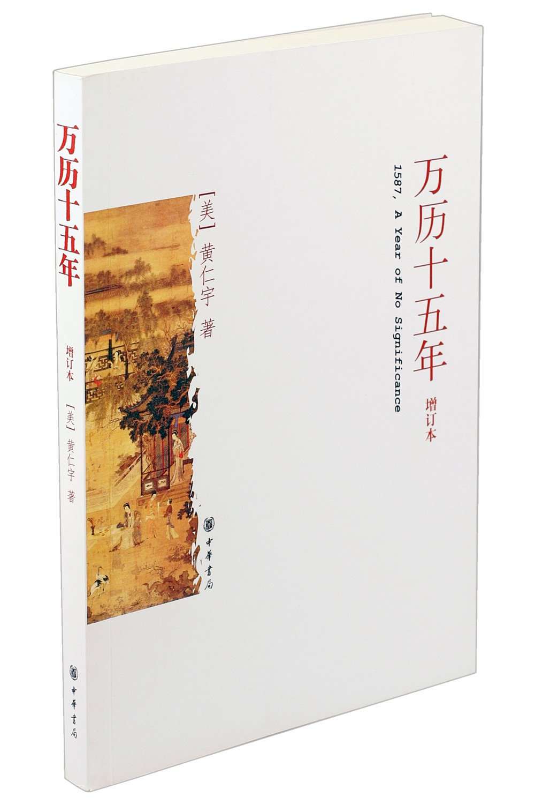
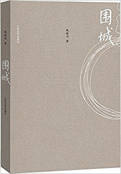

# Q3

## Literature & Social Science

1. **《万历十五年》** (***1587 - A Year of No Significance***)  5.0/5.0

    > [美] 黄仁宇 (作者)

    > 1976

    > 中华书局; 第1版 (2007年1月1日)

    

    几年前在同事的桌子上看到过，觉得书名挺吸引人，不过那时我有大把的待读书，没有
    去翻看几页。如果那会翻看过的话，我觉得就不会过这么几年我才把它读完了。
    这本书畅销了几十年，不过今年应该是另一个销量的小高峰，因为一部大火的电视剧《
    人民的名义》。

    有几个比较有意思的方面。
    首先，作者是美籍华人。
    第二，先出的英文版，后出的中文版，作者亲自翻译的。
    第三，中文版的书名《万历十五年》看不出这本书要讲什么；英文原版的书名则好一些
    ，透露了比中文书名多一点的信息: ***1587: A Year of No Significance***.

    最后来说说内容，书不厚，以传记的方式写了万历年间的六个人：万历皇帝、张居正、
    申时行、海瑞、戚继光、李贽。

    开篇颇有武侠小说的感觉：

    > 公元1587年，在中国为明万历十五年，论干支则为丁亥，属猪。当日四海升平，全年
     并无大事可叙，纵是气候有点反常，夏季北京缺雨，五六月间时疫流行，旱情延及山
     东，南直隶却又因降雨过多而患水，入秋之后山西又有地震，但这种小灾小患，以我
     国幅员之大，似乎年年在所不免。只要小事未曾酿成大灾，也就无关宏旨。总之，在
     历史上，万历十五年实为平平淡淡的一年。
     >
     > 既然如此，着者又何以把《万历十五年》题作书名来写这样一本专着呢？
     >
     > 1587年，在西欧历史上为西班牙舰队全部出动征英的
     前一年。当年，在我国的朝廷上发生了若干为历史学家所易于忽视的事仲。这些事件
     ，表面看来虽似末端小节，但实质上却是以前发生大事的症结，也是将在以后掀起波
     澜的机缘。其间关系因果，恰为历史的重点。由于表面看来是末端小节，我们的论述
     也无妨从小事开始。

1. **《围城》** 5.0/5.0

    > 钱钟书

    > 1946

    > 人民文学出版社; 第2版 (1991年2月1日)

    

    > 在这本书里，我想写现代中国某一部分社会、某一类人物。写这类人，我没有忘记他
    > 们是人类，只是人类，具有无毛两足动物的基本根性。
    >
    > 钱钟书《围城 序》

    第一遍看《围城》，已是十几年前了。高中二年级的时候，借了室友的来看。
    那会阅读渠道闭塞，平时学校不让看闲书。唯一的例外是每个周末，两三个给门卫交了
    手续费的盗版书商，会借着卖各种高考辅导书的机会，夹杂一些小说、期
    刊、杂志之类的，不是二手就是盗版。每到这个时候，几平米的书摊四周就会挤满了人
    。

    《围城》就是在这样的地摊上买的，那个年代的盗版不知如何排版的，错别字特
    别多，好在小说类，不甚因此而影响阅读。第一次读到《围城》，被钱钟书的幽默和文
    风惊异的难以名状，当时摘抄了好多句子和段落。此次重读，还能背诵一些片段出来。
    比如下面这段著名的关于吃葡萄的论述：

    > 他想起在伦敦上道德哲学一课，那位山羊胡子的哲学家讲的话："天下只有两种人。
    > 譬如一串葡萄到手，一种人挑最好的先吃，另一种人把最好的留在最后吃。照例第
    > 一种人应该乐观，因为他每吃一颗都是吃剩的葡萄里最好的；第二种应该悲观，因
    > 为他每吃一颗都是吃剩的葡萄里最坏的。不过事实上适得其反，缘故是第二种人还
    > 有希望，第一种人只有回忆。"从恋爱到白头偕老，好比一串葡萄，总有最好的一颗
    > ，最好的只有一颗， 留着做希望，多么好？

    此次重读，文采和幽默自然仍在，甚至以今天的眼光看，这半个多世纪之前的许多幽
    默仍然逗笑，但阅读的境界已随阅历的增加而有所转移。看到一些句子和段子我
    仍有会抄点笔记，但是已不是单纯的句子迷，而是一些年轻时不会注意到的叙事艺术和
    写作技巧，以及一些极为精妙的为人处世、察言观色、阿谀奉承、临机救场、以及婚姻
    爱情、人生际遇等等之道。

    经典就是这样。不同的年龄阅读，有不同的收获。

1. **《平凡的世界》**  5.0/5.0

    > 路遥

    > 1986

1. **《战争与和平》** (***War and Peace***)

## Science, Philosopy, Economics

1. **《证券投资基金》** 4.5/5.0

    很好的扫盲书。

## Technical

1. ***The Mythical Man Month***

---------------------------------------------------
  [Previous: 2017 Q2](2017_Q2.md)           [Next: 2017 Q4](2017_Q4.md)
