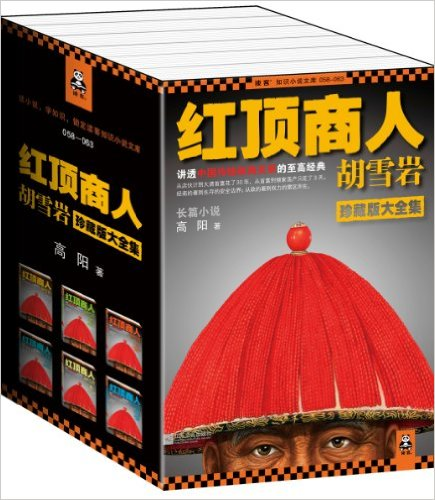
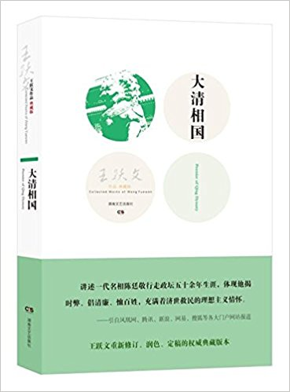
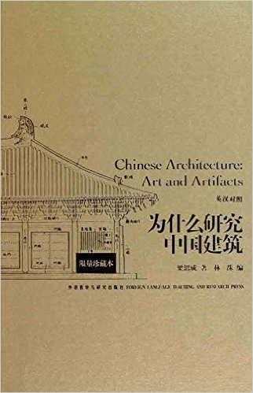
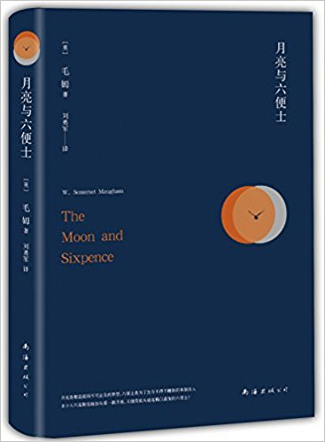
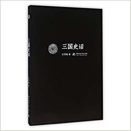
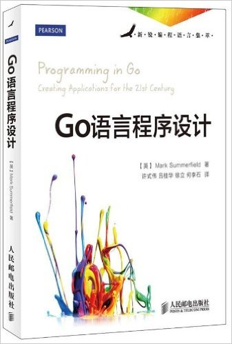

# Q4

## Literature

1. **《红顶商人胡雪岩》**  5.0/5.0

    > 高阳

    > 江苏文艺出版社; 第1版 (2012年5月1日)

    

1. **《大清国相》**  4.5/5.0

    > 王跃文

    > 湖南文艺出版社; 第1版 (2012年7月1日)

    

1. **《为什么研究中国建筑(英汉对照)(限量珍藏版)》** (***Chinease Architecture Art and Artifacts***)  5.0/5.0

    > 梁思成 (作者), 林洙 (编者)

    > 外语教学与研究出版社; 第1版 (2011年4月1日)

    

    梁思成部分论文集，中英文对照。

1. **《月亮与六便士》** (***The Moon and Sixpence***) 4.5/5.0

    > 毛姆 (作者), 刘勇军 (译者)

    > 南海出版公司; 第1版 (2016年4月1日)

    

    写书评的时候才发现是新译本，没读过其他版本，不好做对比。

1. **《三国史话》** 4.8/5.0

    > 吕思勉 (作者)

    > 华中科技大学 (2016年2月1日)

    

    **亚马逊商品介绍**：吕思勉先生是我国现代重要的史学家，与陈垣、陈寅恪、钱穆并称
    “史学四大家”。《三国史话》是吕思勉先生唯一一部通俗性史学著作，他以丰富的历
    史知识为基础，将历史上的真实存在与三国文学中塑造的人物、事件等
    ，进行了深入的辨析，并提出对史书记载和文学记载不可完全相信的观点。

## Science, Philosopy, Economics

## Technical

1. ***Programming in Go***, 4.5/5.0

    > Mark Summerfield

    > 2012

    

    Creating applications for 21st century!

---------------------------------------------------
  [Previous: 2017 Q3](2017_Q3.md)
