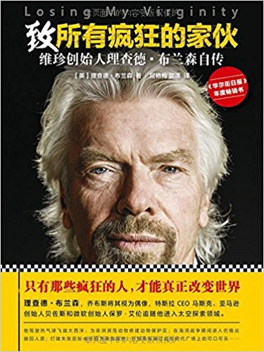
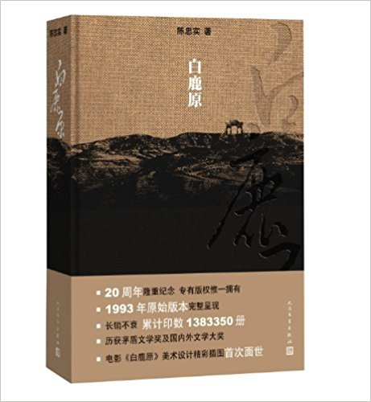
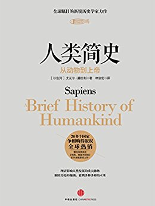
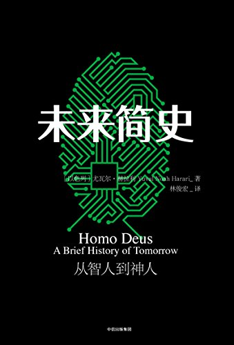

# Q1

## Literature & Social Science

1. **《致所有疯狂的家伙:维珍创始人理查德·布兰森自传》** (***Losing My Virginity***) 4.0/5.0

    > 2017年8月21日

    > Richard Branson (作者), 屈艳梅 (译者), 蓝莲 (译者

    

1. **《一只特立独行的猪》** 4.0/5.0

    > 王小波

1. **《沙丘》**（***Dune***） -/5.0

    太无聊了。看了200多页还是没提起兴趣。

1. **《中国通史》**  5.0/5.0

    > 吕思勉

    > 1930s

    “简史”，“通史”这些字眼，经常让人想到那种给小学生看的识字读本，抽掉了水分和营
    养，大人看这种书的唯一收获就是快速了解一些典故和历史片段。

    然而最近看到的两边书：《中国通史》和《人类简史》，却打破了我的这种思维定式。

    《中国通史》是通史，却不是按照一般的编年体一个朝代一个朝代的讲下来，而是分为
    二三十个主题，从上古时代到20世纪30年代的政治、经济、地理、社会、文化等作了全
    面的论述和梳理，每个主题都像是一个专题研究。

    吕思勉先生是民国时期人，国史四大家之一，学识渊博，各种古文典籍旁征博引、信手
    拈来。这本书是当时为大学历史系编写的教材，水平之高，真是令人叹服。

    用学长的表达方式说，**水平比现在的大学教材，不知道高到哪里去了**。

1. **《白鹿原》**  4.8/5.0

    > 陈忠实

    > 出版社: 人民文学出版社; 第1版 (1993年6月1日)

    

    关中平原上的一部恢弘史诗。

1. **《蒋勋说宋词》**  4.9/5.0

    > 蒋勋

    某天在油管上闲逛时发现了一档很有意思的艺术科普栏目《意外艺术》，主持人颇具特
    色、几十期如一日的穿着一件绿色的连衣裙，以诙谐幽默的方式普及音乐、书法、绘
    画、雕塑等艺术。

    这样的良心节目难得一见，我一连刷了几十期（每期15～20分钟左右）。其中有几
    期是跑到台湾采访的蒋勋，从这里才知道了蒋勋老师。然后马上去亚马逊将他的一些
    著作加入了书单。

    ----

    上周末，和Eric Wang老板约在徐家汇吃饭。在美罗城的中华书局，最靠近人行道的书
    架上，恰好看到了蒋勋说xx系列。近年来虽然买书都首选网上，但只要有机会，还是会
    支持下实体书店，虽然同样的书，比网上要贵好多。这样买回了这本《蒋勋说宋词》。
    另一个小小的惊喜是，封面的推荐语竟来自张晓风 —— 我最喜欢的散文作家。

    ----

    第一章还没读完，我就有了一口气读完的冲动，我在阅读的过程中也好几次难掩激动，
    将讲的特别好的段落拍下来，分享给一些朋友，然后极力推荐《蒋勋说xx》系列给他们
    。

    以前觉得那些长篇的诗词解释都是牵强附会、强行解释 —— 比较有代表性的，就是中学
    语文必考的诗词鉴赏。但是看了这本书后，才发现至少对于我这种文学基础差、美学基
    础更差的人来说，是需要在蒋勋老师这样的美学大家引导下，才能体会到其中之美的。

    学生时代能遇到这样的老师改是多么幸运。

## Science & Technology, Philosopy

1. **《人类简史》** （***Sapiens: A Brief History of Humankind***） 4.6/5.0

    > Yuval Noah Harari (作者), 林俊宏 (译者)

    > 2015

    

    这本简史也不是流水帐，不过前面从几万年之前进化到农业社会部分没什么太大亮点；
    农业部分的讲述，也不是太高明；工业社会到当代社会部分，包括资本主义和当代经济
    的形成、各种宗教的发展、科技和政治发展，写的非常精彩。

1. **《未来简史》** （***Homo Deus: A Brief History of Tomorrow***） 4.6/5.0

    > Yuval Noah Harari (作者), 林俊宏 (译者)

    > 2017

    

    《人类简史》总结的是过去，《未来简史》探讨的是（不远的）未来。

    如果说《三体》描绘的是未来几百年后的人类场景，那么《未来简史》所描绘的就是未
    来几十年（一百年）以内的世界。其总结起来，有三个可怕的趋势：

    1. 所有生物都是算法，生命就是进行数据处理
    1. 智能正与意识脱钩
    1. 无意识但具备高度智能的算法，可能很快就会比我们更了解我们自己

    社会讲分化成两个阶级：

    1. 由极少数人组成的精英阶级。他们掌握了维持世界运转的智能算法
    1. 其他人。这部分人活着已经没有什么经济学意义

    细思恐极的事情。

    ----

    书以技术为核心，但大量的篇幅都处在哲学层次，需要花时间细细思考。非常推荐。

1. **《时间简史》** （***A Brief History of Time***） 5.0/5.0

    如果当年中学的物理老师都能这么讲物理，或者哪怕推荐一下这本书，我的物理就不会
    在及格线挣扎了。

    **手提日月向星辰，世间无我这般人。**

## Technical

1. ***Programming in Lua***, 4.5/5.0

    > Roberto Ierusalimschy

    > 2013, 3rd Edition

    

---------------------------------
  [Next: 2018 Q2](2018_Q2.md)
