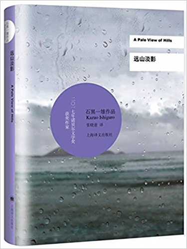
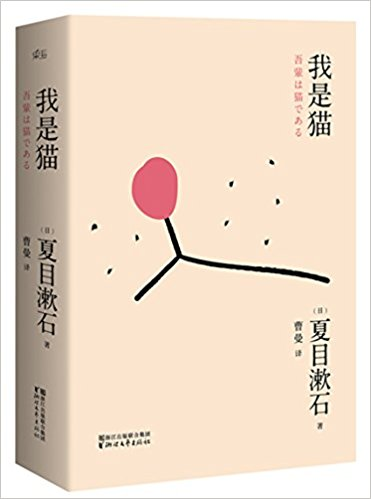
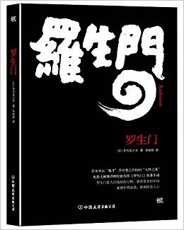
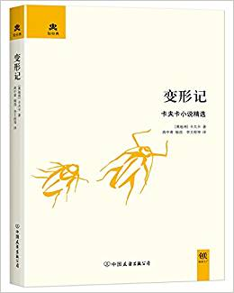
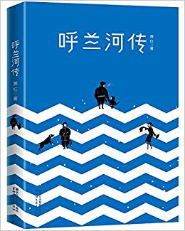
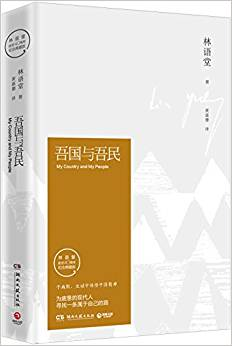
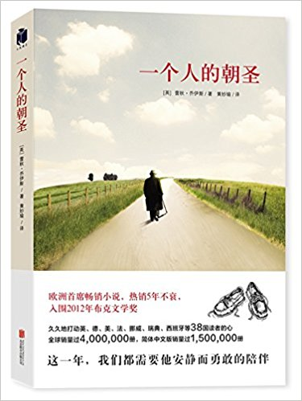
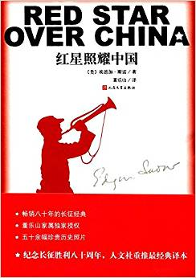
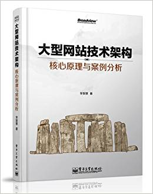

# Q2

## Literature & Social Science

1. **《远山淡影》** (***A Pale View of Hills***) 4.6/5.0

    > 石黑一雄 (Kazuo Ishiguro, 作者), 张晓意 (译者)

    > First Published: 1982

    > 上海译文出版社; 第1版 (2011年4月1日)

    

    前几日去苏州诚品书店，回来买了两本书：夏目漱石的《我是猫》和石黑一雄这本
    《远山淡影》。和很多人一样，我知道石黑一雄是因为他获得了**2017年诺贝尔文学奖**（
    作为日裔英国作家）。一波新闻热度伴随着一波作品销量迅速过去之后，石黑一雄
    的名字也从公众的视线中再次消逝了。如果这次没有去诚品（或者任何一家实体书店）
    ，我可能也不会有机会读到他的作品。

    《远山淡影》是石黑一雄的成名作。有的编辑推荐语说它是“技惊文坛的处女作”
    ，我读过之后，“技惊文坛”这四个字是一点都没有感受到的，只有一种模糊
    的、潮湿的、淡淡的感觉，就像书名描绘的：远山淡影，像一副缥缈的山水画，淡
    淡的线条和墨色勾勒出一种意境。

    并没有什么文学技巧能“惊”到我, 可能有两个原因：一是编辑是个水货，为了卖书乱
    写推荐语，也不管措辞严谨与否；也有可能是，这部作品三十多年前出来的时候，它的
    叙事风格确实是前无古人的，而在随后的几十年中这种风格慢慢被媒体（尤其是电影媒
    体）接受，我们会已经在很多作品比如电影中看到了这样的叙事和表现方式；因此
    作为一个三十年之后的读者，就不会强烈地感受到它的“惊四座”之处了。

    不过，这并不是说它是一部过时、不再有价值的作品；相反，它的艺术价值并没有
    时代的任何限制，因此才能在三十年间不断再版。

    ----

    这部作品篇幅较短，三四个小时可以读完。

    从书名上看不出是部什么样的作品，甚至都看不出是小说还是其他类型的著作，这在小
    说界大概也是少见的，因为大部分小说的名字都很直接——这样才能吸引到读者。《远山
    淡影》正相反，上来就给你一种虚无缥缈的感觉，大概只有耐得住性子的人才能驻足翻
    翻看。

    情节没有什么波澜，主人公是一个迁居英国的日本主妇，有两个女儿，大女儿开场时就
    已经死了，在曼彻斯特自杀，整部著作大部分是主人公回忆在日本期间的事情。

    回忆是黑石的作品里最重要的题材。 **黑石说：“我喜欢回忆，是因为回忆是我们审视
    自己生活的过滤器。回忆模糊不清，就给自我欺骗提供了机会。作为一个作家，我更关
    心的是人们告诉我发生了什么，而不是实际发生了什么。”**

    黑石关心的不是外部世界，而是人复杂的内心世界。通过扭曲的回忆所反应的微妙东西
    ，帮助人们窥探这个世界。诺贝尔奖授奖词说： **“石黑一雄的小说，以其巨大的情感
    力量，发掘了隐藏在我们与世界联系的幻觉之下的深渊。”**

    ----

    这个中文译本附录了一篇“译后序”，对这部作品及黑石的创作作了一些的解读，
    写的挺好。另外说到翻译，这个黑石系列的翻译，尤其是书名的翻译是真
    好，看过一部作品之后应该就体会到了。译者不仅领悟了作品表达的意思，而且
    在信雅达之上，翻译出了诗意。列举几部翻译的书名感受一下：

    * A Pale View Of Hills - 远山淡影
    * The Remains of the Day - 白日将尽
    * When We Were Orphans - 我辈孤雏
    * Never Let Me Go - 莫失莫忘

    ----

    好作品，有时间，想把黑石一雄的作品全部读一遍。

1. **《我是猫》** (***I Am A Cat***) 3.9/5.0

    > 夏目漱石 (作者), 曹曼 (译者)

    > 浙江文艺出版社; 第1版 (2015年6月30日)

    

    对背景没有了解的话，会觉得无聊，以猫的角度描写无聊的主人的生活。

    ----

    不过还是能明显感受到夏目漱石极其深厚的文学功力。 **当我们称赞一个中国学者惊
    为天人的文学造诣时，常用“博古通今，学贯中西”四个字; 如果用类似的方式形容夏目
    漱石，那可以说“博古通今，学贯日中西”。** 现在已经很难想象一个日本人对中国典
    故信手拈来到了那样的程度。

1. **《罗生门》** 3.9/5.0

    > 芥川龙之介 (作者), 朱娅姣 (译者)

    > 中国友谊出版公司; 第1版 (2016年11月1日)

    

    除了短篇《罗生门》，被黑泽明的电影演绎而特别出名之外，其他短篇都没读出艺术性
    来，翻译的也一般。

    ----

    一个做编辑的朋友说，翻译的书最好选 **上海译文出版社**和 **译林**，下次记住了。

1. **《变形记：卡夫卡精选》** 3.9/5.0

    > 卡夫卡 (Kafka F.) (作者), 李文俊 (译者)

    > 中国友谊出版公司; 第1版 (2013年6月1日)

    

    除了《变形记》和《》之外，其他看不出什么意思，而且很多残篇。适合做卡夫卡
    研究的人看，不适合从来没读过卡夫卡、慕名而来的人，像我这样。

    看译本也是比较新的，没有对比，不知道质量怎么样。

    卡夫卡盛名在外，想了解的话，还是应该先从长篇读起。

1. **《呼兰河传》** 4.7/5.0

    > 萧红 (作者), 陆伟黎 (插图作者), 李思颖 (插图作者)

    > 浙江文艺出版社; 第1版 (2016年11月30日)

    

    《呼兰河传》是一部对我来说很有名的作品，我确信在小卡片上记录过这个名字。从书
    名看，既然是传，那写的应该是豪杰。联系到作者的生活年代（1911-1942），很容易
    使人猜想，这部“传”讲的可能是民国时期呼兰河畔某位扛把子的传奇，毕竟在东北这块
    土地，从来不乏这样的素材。

    但是整部书过了四分之一，期待的英雄故事仍然没有开场，甚至都没有情节，只是一
    再的描写呼兰河畔的种种风土人情。熬过了四分之一，情节开始从“我”——一个地主家
    的小孙女身上徐徐展开 —— 展开，展开，再展开 —— 一直到了最后，也没有所期待的豪
    杰，激荡，革命。有的只是祖父，长工，四邻八舍，庙会，跳大神，婆婆，儿媳，跳井
    ，上吊，蒸粘糕，磨豆腐，种黄瓜，蝴蝶，蚂蚱，蜻蜓......

    在尾声中，作者写到： **“以上我所写的并没有什么优美的故事，只因他们充满我幼
    年的记忆，忘却不了，难以忘却，就记在这里了。"**

    这一句，就是对本书最好的总结和导读。我确信每个乡下的孩子都会从中读到自己的童
    年，也因此理解了为何这本书被列入了中小学必读名著。

    ----

    2014年有一部文艺片《黄金时代》，说是纪念萧红，我还没看过。

    ----

    关于作者：被誉为民国四大才女之一，和鲁迅是好友。萧红是笔名，学名张秀环。22岁
    发表第一篇小说，1940年病逝与香港，年仅31岁。

1. **《吾国与吾民》** (***My Country and My People***) 5.0/5.0

    > 林语堂 (作者), 黄嘉德 (译者)

    > 湖南文艺出版社; 第1版 (2016年6月1日)

    

    以前看到林语堂，首先想到的是《京华烟云》，因此一直以为林语堂是写小说的（先生
    的棺材板还盖不盖得住。。。）。

    读过这本从英文翻译回来（**是的，原版是英文**）的《吾国与吾民》，大为惊骇，
    林语堂先生的文学修养简直比八十一个博士头衔的胡适还高深。也可能是胡适的
    文学专注我还没拜读过，反正看这部并不太厚的书所花的时间至少可以看本三本胡适的
    畅销著作了（这次胡适先生的棺材板还盖不盖得住。。。）。

    林语堂从小在教会学堂读书，之后去英国留学，是当时第一流的用英文写作的中国作家。
    ***My Country and My People*** 是其在西方文坛的成名作与代表作。

    这个译本也是极具文采，因为有很多我不认识的字。

    ----

    亚马逊书评：《吾国与吾民(纪念典藏版)》将中国人的性格、心灵、理想、生活、政治
    、社会、艺术剖释得非常美妙，并与西方人的性格、理想、生活等做了深入的比较，在
    海内外引起轰动，美国许多知名人士推崇备至，被译成多种文字，在世界广泛流传。

1. **《一个人的朝圣》** (***The Unlikely Pilgrimace of Marolo Fry***) 3.9/5.0

    > 蕾秋·乔伊斯 (Rachel Joyce) (作者), 黄妙瑜 (译者)

    > 北京联合出版公司; 第1版 (2017年6月1日)

    

    书名非常的小资和文艺，很容易让人联想到是去西藏。

    其实是一本国外小说，讲述一个
    六十多岁退休在家生活非常失败的老头徒步穿越英国，寻找内心救赎的故事。情节并不
    是太有新意，末段的部分篇幅甚至高度重合阿甘正传的情节。

    我相信很多人是被书名吸引来的。

1. **《红星照耀中国》** (***Red Star Over China***) 5.0/5.0

    > 埃德加·斯诺 (作者), 董乐山 (译者)

    > 人民文学出版社; 第1版 (2016年6月1日)

    

    借用某编辑在倾力推荐了几十本书之后终于词穷时的表达：**“这本书超～好看”**。

    不严谨地说，本书能：

    让小学生辨识谁是好人谁是坏人；帮中学生串起过于粗砺的历史教科书片段；
    助高中生更加全面深入地了解近代抗战史；作为入党读物帮大学生端正思想态度;
    令研究生又红又专地走上工作岗位；最重要地，帮一些人拿到硕士学位。

## Science & Technology, Philosopy

## Technical

1. **《大型网站技术架构》** 4.0/5.0

    > 李智慧 (作者)

    > 电子工业出版社; 第1版 (2013年9月1日)

    

    没有什么深奥的内容，读起来有点像博客合集的感觉。三四个小时就可以翻完。

    简要而比较全面地介绍了大型网站在设计和优化过程中
    需要注意的一些问题。最后还分享了一点架构师/技术leader在工作上的软技巧。

    值得一看。

------------------------------------------------------
  [Previous: 2018 Q1](2018_Q1.md)          [Next: 2018 Q3](2018_Q3.md)
