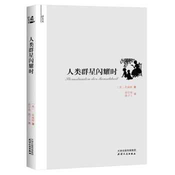
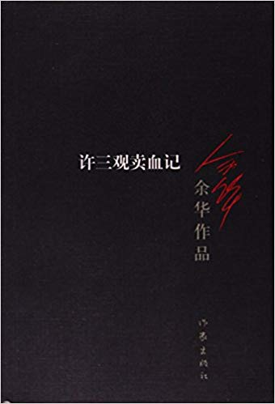

# Q3

## Literature & Social Science

1. **《人类群星璀璨时》** 4.0/5.0

    > [奥] 茨威格 著，高中甫，潘子立 译

    > 出版社： 天津人民出版社 (出版时间：2011-06-01)

    

1. **《许三观卖血记》** 4.8/5.0

    > 余华 (作者)

    > 作家出版社; 第3版 (2012年9月1日)

    

## Science, Philosopy, Economics

## Technical

---------------------------------------------------
  [Previous: 2018 Q2](2018_Q2.md)           [Next: 2018 Q4](2018_Q4.md)
