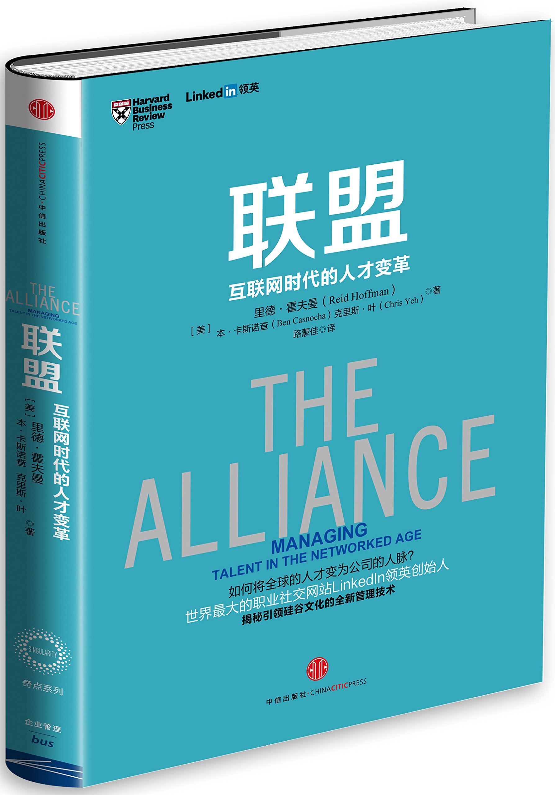
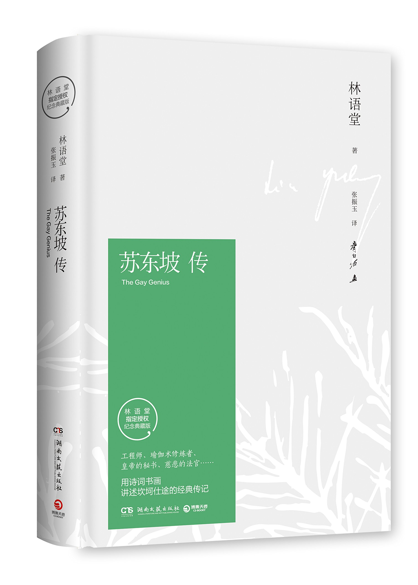

# Q1

## Literature & Social Science

1. **《联盟:互联网时代的人才变革》** (***The Alliance***: Managing Talent in the Networked Age) 4.4/5.0

    > 中信出版股份有限公司; 第1版 (2015年2月1日)

    > 里德•霍夫曼 (作者), 本•卡斯诺查 (作者), 克里斯•叶 (作者), 路蒙佳 (译者)

    

    这本书来自前直属老大的推荐。
    核心内容其实很简单：**雇佣制时代已经结束，现在雇主和雇员之间应该采用新型的工
    作关系：建立联盟**。说更具体一点：平等商讨，找到双方的共赢点。

    举个例子：一个员工和自己的经理签订一份（只具有道德效力的）联盟契约：

    * 员工帮经理完成一个项目的开发和落地
    * 经理帮员工完成项目开发所需的领导经验积累，可能还有附带的升值加薪

    这个联盟到期之后，员工是去是留，双方再另行讨论。这种思想还是颇有道理的，尤其
    在硅谷，对高端人才。

    再来说篇幅。这本只有几万字的书，硬生生被中信出版社排版成一本正常厚度的书，所
    有字间距特别宽，每页的字很少。因为内容比较少，所以几个小时就可以看完。

    推荐职场人士阅读。

1. **《苏东坡传》** (***The Gay Genious***) 4.6/5.0

    > 湖南文艺出版社; 第1版 (2018年1月1日)

    > 林语堂 (作者)，（译者）

    

    林语堂说：“我写作《苏东坡传》并没有什么特别的目的，只是为了好玩。”
    但就是这样一部“为了好玩”的作品，半个多世纪以来却名声在外，引得无数人拜读。

    现在市面上的大部分传记作品都像流水帐，
    出彩完全靠情节（以及传记的主人公是否出名）。这本则不同，融入了大量的哲学、文
    学、诗歌、绘画、宗教、人生、民主、历史等层面的思考与讨论，处处引经据典，对苏
    东坡的著作信手拈来，可以看出林语堂功力之深厚。

    需要说明，《苏东坡传》原书为英文写作，书名为 ***The Gay Genious***，中文版
    是翻译过来的，但翻译同样非常自然乃至文采斐然，至少不是减分项。

    强烈推荐！

## Science & Technology, Philosopy

## Technical

---------------------------------
  [Next: 2019 Q2](Q2.md)
