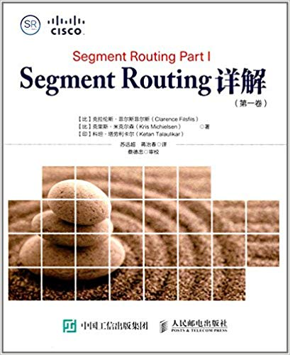

# Q2

## Literature & Social Science

1. **《烟火人间》** 4.4/5.0

    > 老舍

    > 长江文艺出版社; 第1版 (2017年11月1日)

    

    看到标题和作者，大部分肯定和我一样，怀疑这个老舍到底是不是那个老舍。答案：是
    。

    书名非常像小清新风格的网文标题，内容其实是精选了老舍的一些较有生活气息的文章
    。考虑到现在图书市场这么艰难，而所选的角度及内容确实还不错，取这么个书名也原
    谅策划编辑了。

1. **《局外人》** /5.0

    > 加缪 (作者), 邹笃双 (译者)

    > 江苏凤凰文艺出版社; 第1版 (2017年8月1日)

    

    故事非常简单，行文极其罗嗦，有没有文学价值，得看书评。和陀思妥耶夫斯基有点像
    。

1. **《刀锋》** 4.5/5.0

    > 威廉·萨默塞特·毛姆 (作者), 林步升 (译者)

    > 浙江文艺出版社; 第1版 (2017年2月1日)

    

    毛姆净写些神神叨叨的人物。

1. **《老人与海》** 4.5/5.0

    > 欧内斯特·海明威 (作者), 作家榜经典 (编者), Slava Shults (插图作者), 鲁羊 ( 译者)

    > 浙江文艺出版社; 第1版 (2017年2月10日)

    

    新译本，翻译一般，译者口气倒是非常的大，不知哪来的自信。

1. **《狼图腾》** 4.0/5.0

    > 姜戎 (作者)

    > 长江文艺出版社; 第1版 (2014年12月1日)

    

    民间文学（地摊文学，无贬义）的丰碑。像是老一辈人放在床头、书页已经发黄、
    封面已经磨破甚至都没了的那类书。

    不足之处，像是命题作文，用力过猛，给人感觉一直在刻意紧扣主题。

## Science & Technology, Philosopy

## Technical

1. ***BGP in the Data Center*** 4.8/5.0

    > Dinesh G. Dutt

    > O'Reilly Media, 2017

    

    原书很短，只有 90 页不到，但理论和实践兼备，是现代 数据中心和 BGP 入门的很好
    参考。

    作者 Dinesh G. Dutt 是一家网络公司的首席科学家，在网络行业有 20 多年工作经验
    ，曾 是 Cisco Fellow，是 TRILL、VxLAN 等协议的合作者（co-author）之一。

    BGP 原本是用于服务供应商（service provider）网络的，并不适用于数据中心，因此
    进入 到数据中心的 BGP 是经过改造的。本文介绍的就是数据中心中的 BGP（BGP in
    the data center），这与传统BGP 还是有很大不同的。

    读书笔记：https://arthurchiao.github.io/blog/bgp-in-data-center-zh/

1. ***Internet Routing Architectures*** 4.8/5.0

    > Sam Halabi (Author)

    > Cisco Press; 2 edition (September 2, 2000)

    

    本书致力于解决实际问题，书中包含大量的架构图、拓扑图和真实场景示例，内容全面
    而且 易于上手，是不可多得的良心之作。本书目的是使读者成为将自有网络集成到全
    球互联网 （integrating your network into the global Internet）领域的专家。

    读书笔记：https://arthurchiao.github.io/blog/internet-routing-architecture-zh/

1. **《Segment Routing 详解：第一卷》** 4.0/5.0

    > Clarence Filsfils, Kris Michielsen, Ketan Talaulikar

    > 人民邮电出版社; 第1版 (2017年10月1日)

    

    SR：我司网络专家强烈推荐的一项新技术。

    翻译应该已
    经很努力了，第一章非常流畅（因为技术性偏弱，介绍一些概念及历史），但从第二章
    开始就变得越来越云里雾里。建议能看原版的还是尽量看原版，或者对照阅读。看原
    版时只需要思考**内容**（这个句子在讲什么），而翻译版要先思考**句子**（拆解主
    谓宾状语，把一堆拗口的中文术语重新在大脑中排列成能理解的句子），然后才能思考**
    内容**，阅读速度反而更慢。专业的技术类文档有时确实很难流畅地翻译。

    另外本书排版非常用心，例如所有中英文混合的句子中，单词前后都加了空格，视觉体
    验很好。

1. **Building Microservices** 4.4/5.0

    > Sam Newman

    > 2015

    ThoughtWorks 的人真能写，给一个炮仗他们都能写出火箭的感觉。学院
    派代表。不过看得出本书作者还是有较多实践经验的，并非完全停留在理论层面。

    总体来说，本书偏理论而非实现，可作为内功心法，适合架构师或有经验的系统工程师
    。

1. **Microservices AntiPatterns and Pitfalls** 4.4/5.0

    > Mark Richards

    > O’Reilly, 2016, 1st edition

    一本 60 页左右的小书。介绍微服务中可能会遇到的陷阱及应对方式，值得一看。

------------------------------------------------------
  [Previous: 2019 Q1](Q1.md)          [Next: 2019 Q3](Q3.md)
